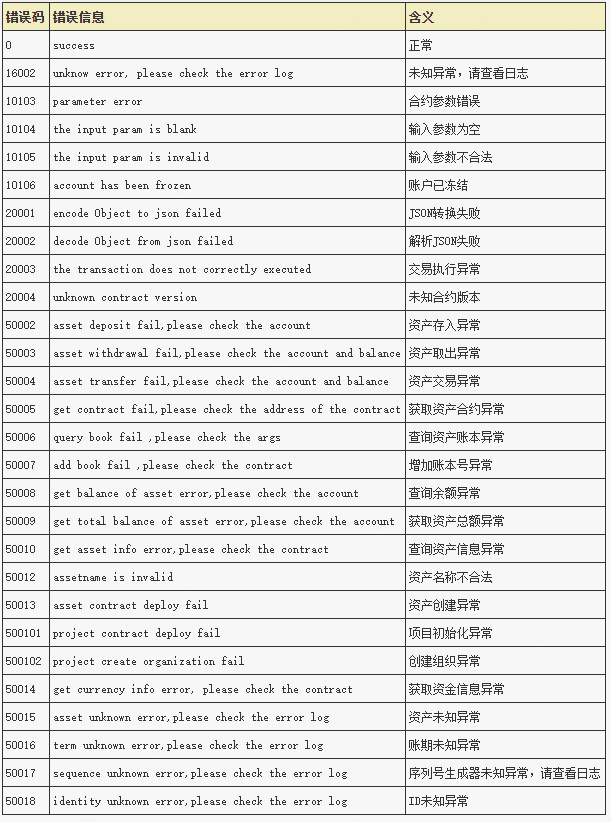

## 错误码定义



## ProjectService

项目接口。

### createProject
初始化项目。
#### 参数
​	无

#### 返回值
- `responseData` - 区块链账本交易返回对象。

   - `result:` - 初始化项目返回合约地址列表。

     - `result.get(0):`- 项目合约地址。
     - `result.get(1):`- 账户管理合约地址。
     - `result.get(2):`- 授权管理合约地址。
     - `result.get(3):`- 授权中心合约地址。
     - `result.get(4):`- 资产管理合约地址。

   - `errorCode:` - 错误码[错误码定义](#id1)。

   - `errMsg:`- 详细错误信息。

   - `transactionInfo:` 区块链交易信息。

     - `blockNumber:`- 区块号。
     - `transactionHash:`- 交易哈希。
     - `transactionIndex:`- 交易序号。
     
     

#### 示例

```java
ResponseData<List<String>> rsp = projectService.createProject();
log.info("\r\n String projectAddr = \"{}\"; \r\n    " +
                "String accountManagerAddr = \"{}\"; \r\n   " +
                "String authManagerAddr = \"{}\"; \r\n   " +
                 "String authCenterAddr = \"{}\";  \r\n  " +
                 "String assetManagerAddr = \"{}\";",
         rsp.getResult().get(0),
         rsp.getResult().get(1),
         rsp.getResult().get(2),
         rsp.getResult().get(3),
         rsp.getResult().get(4));
```

### createOrganization

创建组织。

#### 参数

​	无

#### 返回值

`responseData` - 区块链账本交易返回对象。

- `result:` - 组织合约地址。

- `errorCode:` - 错误码[错误码定义](#id1)。

- `errMsg:`- 详细错误信息。

- `transactionInfo:` 区块链交易信息。

  - `blockNumber:`- 区块号。
  - `transactionHash:`- 交易哈希。
  - `transactionIndex:`- 交易序号。

#### 示例

```java
ResponseData<List<String>> rsp = projectService.createOrganization();
log.info("Organization Address:{}", ret.getResult());
```

### addOrgDefaultAuth

赋予组织默认权限。

#### 参数

- `authMangerAddr:`- 授权管理合约地址
- `orgAddr:`- 组织合约地址

#### 返回值

​	无

#### 示例

```java
String authMangerAddr="0x2c4269b93bab5a83565279f897df031c88a86f79";
String orgAddr="0x3c4269b93bab5a83565279f897df031c88a86f79";
projectService.addOrgDefaultAuth(authMangerAddr,orgAddr);
```


### addDefaultKeyType

添加默认操作到权限列表。

#### 参数

- `authCenterAddr:` - 授权中心合约地址。

#### 返回值

`responseData` - 区块链账本交易返回对象。

- `result:` - 是否添加成功。

- `errorCode:` - 错误码[错误码定义](#id1)。

- `errMsg:`- 详细错误信息。

- `transactionInfo:` 区块链交易信息。

  - `blockNumber:`- 区块号。
  - `transactionHash:`- 交易哈希。
  - `transactionIndex:`- 交易序号。

#### 示例

```java
String authCenterAddr="0x4c4269b93bab5a83565279f897df031c88a86f79";
ResponseData<List<String>> rsp = projectService.addDefaultKeyType(authCenterAddr);
log.info("addDefaultKeyType result:{}", ret.getResult());
```

### createAddOrgAdmin

创建并添加组织管理员。

#### 参数

- `org:` - 组织合约地址。
- `externalAccount:` - 账户外部地址。
- `keyList:`- 账户属性键列表，key值必须通过调用`authCenterService.addKeyType`添加key权限。
- `valueList:` - 账户属性值列表。

#### 返回值

`responseData` - 区块链账本交易返回对象。

- `result:` - 账户内部地址。

- `errorCode:` - 错误码[错误码定义](#id1)。

- `errMsg:`- 详细错误信息。

- `transactionInfo:` 区块链交易信息。

  - `blockNumber:`- 区块号。
  - `transactionHash:`- 交易哈希。
  - `transactionIndex:`- 交易序号。

#### 示例

```java
String org="0x5c4269b93bab5a83565279f897df031c88a86f79";
String externalAccount="0x6c4269b93bab5a83565279f897df031c88a86f79";
LinkedHashMap<String, String> kvMap = new LinkedHashMap<>();
kvMap.put("name","xiaoa");
List<byte[]> keyList = new ArrayList<>();
List<byte[]> valueList = new ArrayList<>();
List<byte[]> kvList = new ArrayList<>();
for(Map.Entry<String,String> entry : kvMap.entrySet()){
	byte[] k = entry.getKey().getBytes(StandardCharsets.UTF_8);
	byte[] v = entry.getValue().getBytes(StandardCharsets.UTF_8);
	keyList.add(k);
	valueList.add(v);
	kvList.add(k);
	kvList.add(v);
}

ResponseData<String> ret = projectService.createAddOrgAdmin(org, externalAccount, keyList, valueList);
log.info("admin inner address:{}", ret.getResult());
```

### addOrgAdmin

添加组织管理员。

#### 参数

- `org:` - 组织合约地址。

- `externalAccount:` - 账户外部地址。

  

#### 返回值

`responseData` - 区块链账本交易返回对象。

- `result:` - 是否添加成功。

- `errorCode:` - 错误码[错误码定义](#id1)。

- `errMsg:`- 详细错误信息。

- `transactionInfo:` 区块链交易信息。

  - `blockNumber:`- 区块号。
  - `transactionHash:`- 交易哈希。
  - `transactionIndex:`- 交易序号。

#### 示例

```java
String org = "0x8c4269b93bab5a83565279f897df031c88a86f79";
String externalAccount = "0x9c4269b93bab5a83565279f897df031c88a86f79";
ResponseData<Boolean> ret = projectService.addOrgAdmin(org, externalAccount);
log.info("addOrgAdmin result:{}", ret.getResult());
```

### hasAccount

判断账户是否存在，存在返回true，反之返回false。

#### 参数

- `externalAccount:` - 账户外部地址。

  

#### 返回值

`responseData` - 区块链账本交易返回对象。

- `result:` - 是否存在账户。

- `errorCode:` - 错误码[错误码定义](#id1)。

- `errMsg:`- 详细错误信息。

- `transactionInfo:` 区块链交易信息。

  - `blockNumber:`- 区块号。
  - `transactionHash:`- 交易哈希。
  - `transactionIndex:`- 交易序号。

#### 示例

```java
String externalAccount = "0x9c4269b93bab5a83565279f897df031c88a86f79";
ResponseData<Boolean> ret = projectService.hasAccount(externalAccount);
log.info("hasAccount result:{}", ret.getResult());
```


### getAllOrg

获取项目下所有组织。

#### 参数

​	无

#### 返回值

`responseData` - 区块链账本交易返回对象。

- `result:` - 组织合约地址列表。

- `errorCode:` - 错误码[错误码定义](#id1)。

- `errMsg:`- 详细错误信息。

- `transactionInfo:` 区块链交易信息。

  - `blockNumber:`- 区块号。
  - `transactionHash:`- 交易哈希。
  - `transactionIndex:`- 交易序号。

#### 示例

```java
ResponseData<List<String>> ret = projectService.getAllOrg();
log.info("getAllOrg:{}", ret.getResult());
```

### getAllAsset

获取项目下所有资产。

#### 参数

- `isFungible:` - 是否为同质化，同质化则为true,非同质化则为false。

#### 返回值

`responseData` - 区块链账本交易返回对象。

- `result:` - 以资产合约地址为Key以及组织合约地址为Value的Map。

- `errorCode:` - 错误码[错误码定义](#id1)。

- `errMsg:`- 详细错误信息。

- `transactionInfo:` 区块链交易信息。

  - `blockNumber:`- 区块号。
  - `transactionHash:`- 交易哈希。
  - `transactionIndex:`- 交易序号。

#### 示例

```java
Boolean isFungible = true;
ResponseData<HashMap> ret = projectService.getAllAsset(isFungible);
log.info("getAllAsset result:{}", ret.getResult());
```

## OrganizationService

组织接口。

### createAccount

创建组织普通账户。

#### 参数

- `externalAccount:` - 账户外部地址。
- `keyList:`- 账户属性键列表，key值必须通过调用`authCenterService.addKeyType`添加key权限。
- `valueList:` - 账户属性值列表。
- `message:`- 参数哈希。
- `rs:`- 使用组织管理员私钥对参数哈希签名。

#### 返回值

`responseData` - 区块链账本交易返回对象。

- `result:` - 账户内部地址。

- `errorCode:` - 错误码[错误码定义](#id1)。

- `errMsg:`- 详细错误信息。

- `transactionInfo:` 区块链交易信息。

  - `blockNumber:`- 区块号。
  - `transactionHash:`- 交易哈希。
  - `transactionIndex:`- 交易序号。

#### 示例

```java
// 组织地址
String orgAddr="0x8a27d2e748799ae6b929de2e69745fc8a5fe8e31";
 /**
  *  账户外部地址 可通过如下方式创建：
  *  CryptoSuite ecdsaCryptoSuite = new CryptoSuite(CryptoType.ECDSA_TYPE);
  *  String accountAddr = ecdsaCryptoSuite.createKeyPair().getAddress();
  */
String externalAccount = "0x5b27d2e748799ae6b929de2e69745fc8a5fe8e31"; 
// 授权中心地址
String authCenterAddr="0x6a27d2e748799ae6b929de2e69745fc8a5fe8e31";
// 组织管理员公私钥对
CryptoSuite org1Admin = new CryptoSuite(CryptoType.ECDSA_TYPE, "admin private key");

// 封装合约所需参数 参考创建组织管理员账户
// 组装参数并对参数hash
List<byte[]> keyList = new ArrayList<>();
List<byte[]> valueList = new ArrayList<>();
List<byte[]> kvList = new ArrayList<>();
for(Map.Entry<String,String> entry : kvMap.entrySet()){
     byte[] k = entry.getKey().getBytes(StandardCharsets.UTF_8);
     byte[] v = entry.getValue().getBytes(StandardCharsets.UTF_8);
     keyList.add(k);
     valueList.add(v);
     kvList.add(k);
     kvList.add(v);
}

// 加载authCenterService
AuthCenterService authCenterService =  new AuthCenterService<>(blockchain, authCenterAddr);
// 加载orgService
OrganizationService<Organization> orgService = new OrganizationService(blockchain, orgAddr);

// 获取交易调用方交易序号
BigInteger nonce = authCenterService.getNonceFromAccount(org1Admin.getAddress()).getResult();
// 组装交易参数
byte[] args = OpenLedgerUtils.concatByte(OpenLedgerUtils.convertStringToAddressByte(externalAccount),
                OpenLedgerUtils.concatByte(kvList),
                OpenLedgerUtils.getBytes32(nonce.toByteArray()));
// 对交易参数进行hash
byte[] message = OpenLedgerUtils.computeKeccak256Hash(args);
// 使用交易调用方私钥对hash的参数进行签名
ECDSASignatureResult sign = OpenLedgerUtils.sign(org1Admin.getCryptoKeyPair(), message);

// 调用创建普通账户接口
ResponseData<String> ret = orgService.createAccount(externalAccount, keyList, valueList, message, sign);
// 获取账户内部地址
String accountInnerAddress = ret.getResult();
```


### cancel

注销账户。

#### 参数

- `externalAccount:` - 账户外部地址。

- `message:`- 参数哈希。

- `rs:`- 使用组织管理员对参数哈希进行签名。

  

#### 返回值

`responseData` - 区块链账本交易返回对象。

- `result:` - 操作是否成功。

- `errorCode:` - 错误码[错误码定义](#id1)。

- `errMsg:`- 详细错误信息。

- `transactionInfo:` 区块链交易信息。

  - `blockNumber:`- 区块号。
  - `transactionHash:`- 交易哈希。
  - `transactionIndex:`- 交易序号。

#### 示例

```java
//注销账户外部地址
String externalAccount = "0x9c4269b93bab5a83565279f897df031c88a86f79";
// 组织管理员公私钥对
CryptoSuite org1Admin = new CryptoSuite(CryptoType.ECDSA_TYPE, "admin private key");
BigInteger nonce = authCenterService.getNonceFromAccount(org1Admin.getCryptoKeyPair().getAddress()).getResult();
byte[] args = OpenLedgerUtils.concatByte(OpenLedgerUtils.convertStringToAddressByte(externalAccount),
                OpenLedgerUtils.getBytes32(nonce.toByteArray()));
byte[] message = OpenLedgerUtils.computeKeccak256Hash(args);

ECDSASignatureResult sign = OpenLedgerUtils.sign(org1Admin.getCryptoKeyPair(), message);
ResponseData<Boolean> ret = orgService.cancel(externalAccount,message,sign);
log.info("cancel result:{}", ret.getResult());
```


### freeze

冻结账户。

#### 参数

- `externalAccount:` - 账户外部地址。

- `message:`- 参数哈希。

- `rs:`- 使用组织管理员对参数哈希进行签名。

  

#### 返回值

`responseData` - 区块链账本交易返回对象。

- `result:` - 操作是否成功。

- `errorCode:` - 错误码[错误码定义](#id1)。

- `errMsg:`- 详细错误信息。

- `transactionInfo:` 区块链交易信息。

  - `blockNumber:`- 区块号。
  - `transactionHash:`- 交易哈希。
  - `transactionIndex:`- 交易序号。

#### 示例

```java
//冻结账户外部地址
String externalAccount = "0x9c4269b93bab5a83565279f897df031c88a86f79";
// 组织管理员公私钥对
CryptoSuite org1Admin = new CryptoSuite(CryptoType.ECDSA_TYPE, "admin private key");
BigInteger nonce = authCenterService.getNonceFromAccount(org1Admin.getCryptoKeyPair().getAddress()).getResult();
byte[] args = OpenLedgerUtils.concatByte(OpenLedgerUtils.convertStringToAddressByte(externalAccount),
                OpenLedgerUtils.getBytes32(nonce.toByteArray()));
byte[] message = OpenLedgerUtils.computeKeccak256Hash(args);

ECDSASignatureResult sign = OpenLedgerUtils.sign(org1Admin.getCryptoKeyPair(), message);
ResponseData<Boolean> ret = orgService.freeze(externalAccount,message,sign);
log.info("freeze result:{}", ret.getResult());
```


### unfreeze

解冻账户。

#### 参数

- `externalAccount:` - 账户外部地址。

- `message:`- 参数哈希。

- `rs:`- 使用组织管理员对参数哈希进行签名。

  

#### 返回值

`responseData` - 区块链账本交易返回对象。

- `result:` - 操作是否成功。

- `errorCode:` - 错误码[错误码定义](#id1)。

- `errMsg:`- 详细错误信息。

- `transactionInfo:` 区块链交易信息。

  - `blockNumber:`- 区块号。
  - `transactionHash:`- 交易哈希。
  - `transactionIndex:`- 交易序号。

#### 示例

```java
//解冻账户外部地址
String externalAccount = "0x9c4269b93bab5a83565279f897df031c88a86f79";
// 组织管理员公私钥对
CryptoSuite org1Admin = new CryptoSuite(CryptoType.ECDSA_TYPE, "admin private key");
BigInteger nonce = authCenterService.getNonceFromAccount(org1Admin.getCryptoKeyPair().getAddress()).getResult();
byte[] args = OpenLedgerUtils.concatByte(OpenLedgerUtils.convertStringToAddressByte(externalAccount),
                OpenLedgerUtils.getBytes32(nonce.toByteArray()));
byte[] message = OpenLedgerUtils.computeKeccak256Hash(args);

ECDSASignatureResult sign = OpenLedgerUtils.sign(org1Admin.getCryptoKeyPair(), message);
ResponseData<Boolean> ret = orgService.unfreeze(externalAccount,message,sign);
log.info("unfreeze result:{}", ret.getResult());
```

### changeExternalAccount

更新账户外部地址。

#### 参数

- `oldAccount:` - 账户原外部地址。

- `newAccount`: - 账户新外部地址

- `message:`- 参数哈希。

- `rs:`- 使用组织管理员对参数哈希进行签名。

  

#### 返回值

`responseData` - 区块链账本交易返回对象。

- `result:` - 操作是否成功。

- `errorCode:` - 错误码[错误码定义](#id1)。

- `errMsg:`- 详细错误信息。

- `transactionInfo:` 区块链交易信息。

  - `blockNumber:`- 区块号。
  - `transactionHash:`- 交易哈希。
  - `transactionIndex:`- 交易序号。

#### 示例

```java
//账户原外部地址
String oldAccount = "0x9c4269b93bab5a83565279f897df031c88a86f79";
//账户新外部地址
String newAccount = "0x9c4269b93bab5a83565279f897df031c88a86f79";

// 组织管理员公私钥对
CryptoSuite org1Admin = new CryptoSuite(CryptoType.ECDSA_TYPE, "admin private key");
String adminAddress=org1Admin.getCryptoKeyPair().getAddress();
BigInteger nonce = authCenterService.getNonceFromAccount(adminAddress).getResult();
byte[] args = OpenLedgerUtils.concatByte(OpenLedgerUtils.convertStringToAddressByte(oldAccount),
                OpenLedgerUtils.convertStringToAddressByte(newAccount),
                OpenLedgerUtils.getBytes32(nonce.toByteArray()));
byte[] message = OpenLedgerUtils.computeKeccak256Hash(args);

ECDSASignatureResult sign = OpenLedgerUtils.sign(org1Admin.getCryptoKeyPair(), message);
ResponseData<Boolean> ret = orgService.changeExternalAccount(oldAccount,newAccount,message,sign);
log.info("changeExternalAccount result:{}", ret.getResult());
```

### createAsset

创建资产。

#### 参数

- `externalAccount:` - 操作账户外部地址。

- `assetName:`- 资产名称，自定义。

- ``isFungile:`` - 是否为同质化资产，true为同质化，false为非同质化。

- `message:`- 参数哈希。

- `rs:`- 使用组织管理员对参数哈希进行签名。

  

#### 返回值

`responseData` - 区块链账本交易返回对象。

- `result:` - 资产合约地址。

- `errorCode:` - 错误码[错误码定义](#id1)。

- `errMsg:`- 详细错误信息。

- `transactionInfo:` 区块链交易信息。

  - `blockNumber:`- 区块号。
  - `transactionHash:`- 交易哈希。
  - `transactionIndex:`- 交易序号。

#### 示例

```java
//资产名称
String assetName = "assetName101";
Boolean isFungible = true;
// 组织管理员公私钥对
CryptoSuite org1Admin = new CryptoSuite(CryptoType.ECDSA_TYPE, "admin private key");
String adminAddress=org1Admin.getCryptoKeyPair().getAddress();
BigInteger nonce = authCenterService.getNonceFromAccount(adminAddress).getResult();
byte[] args = OpenLedgerUtils.concatByte(OpenLedgerUtils.convertStringToAddressByte(adminAddress),
                OpenLedgerUtils.getBytes32(nonce.toByteArray()));
byte[] message = OpenLedgerUtils.computeKeccak256Hash(args);

ECDSASignatureResult sign = OpenLedgerUtils.sign(org1Admin.getCryptoKeyPair(), message);
ResponseData<String> ret = orgService.createAsset(adminAddress,assetName,isFungible,message,sign);
log.info("createAsset result:{}", ret.getResult());
```

### createCurrency

创建资金。

#### 参数

- `name:` 资金名称。
- `symbol:` 简称。
- `decimals:` 精度。

#### 返回值

- `result:` - 资金合约地址。
- `errorCode:` - 错误码[错误码定义](#id1)。

- `errMsg:`- 详细错误信息。

- `transactionInfo:` 区块链交易信息。

  - `blockNumber:`- 区块号。
  - `transactionHash:`- 交易哈希。
  - `transactionIndex:`- 交易序号。


### addAdmin

添加组织管理员。

#### 参数

- `externalAccount:` - 账户外部地址。

- `role` - 账户角色，目前角色包含`admin`。

- `message:`- 参数哈希。

- `rs:`- 使用组织管理员对参数哈希进行签名。

  

#### 返回值

`responseData` - 区块链账本交易返回对象。

- `result:` - 操作是否成功。

- `errorCode:` - 错误码[错误码定义](#id1)。

- `errMsg:`- 详细错误信息。

- `transactionInfo:` 区块链交易信息。

  - `blockNumber:`- 区块号。
  - `transactionHash:`- 交易哈希。
  - `transactionIndex:`- 交易序号。

#### 示例

```java
//账户外部地址
String externalAccount = "0x9c4269b93bab5a83565279f897df031c88a86f79";
String role="admin";
// 组织管理员公私钥对
CryptoSuite org1Admin = new CryptoSuite(CryptoType.ECDSA_TYPE, "admin private key");
BigInteger nonce = authCenterService.getNonceFromAccount(org1Admin.getCryptoKeyPair().getAddress()).getResult();
byte[] args = OpenLedgerUtils.concatByte(OpenLedgerUtils.convertStringToAddressByte(externalAccount),role.getBytes(),
                OpenLedgerUtils.getBytes32(nonce.toByteArray()));
byte[] message = OpenLedgerUtils.computeKeccak256Hash(args);

ECDSASignatureResult sign = OpenLedgerUtils.sign(org1Admin.getCryptoKeyPair(), message);
ResponseData<Boolean> ret = orgService.addAdmin(externalAccount,role,message,sign);
log.info("addAdmin result:{}", ret.getResult());
```

### removeAdmin

删除组织管理员。

#### 参数

- `externalAccount:` - 账户外部地址。

- `message:`- 参数哈希。

- `rs:`- 使用组织管理员对参数哈希进行签名。

  

#### 返回值

`responseData` - 区块链账本交易返回对象。

- `result:` - 操作是否成功。

- `errorCode:` - 错误码[错误码定义](#id1)。

- `errMsg:`- 详细错误信息。

- `transactionInfo:` 区块链交易信息。

  - `blockNumber:`- 区块号。
  - `transactionHash:`- 交易哈希。
  - `transactionIndex:`- 交易序号。

#### 示例

```java
//账户外部地址
String externalAccount = "0x9c4269b93bab5a83565279f897df031c88a86f79";
// 组织管理员公私钥对
CryptoSuite org1Admin = new CryptoSuite(CryptoType.ECDSA_TYPE, "admin private key");
BigInteger nonce = authCenterService.getNonceFromAccount(org1Admin.getCryptoKeyPair().getAddress()).getResult();
byte[] args = OpenLedgerUtils.concatByte(OpenLedgerUtils.convertStringToAddressByte(externalAccount),
                OpenLedgerUtils.getBytes32(nonce.toByteArray()));
byte[] message = OpenLedgerUtils.computeKeccak256Hash(args);

ECDSASignatureResult sign = OpenLedgerUtils.sign(org1Admin.getCryptoKeyPair(), message);
ResponseData<Boolean> ret = orgService.removeAdmin(externalAccount,message,sign);
log.info("removeAdmin result:{}", ret.getResult());
```

## AuthCenterService

授权接口。

### addKeyType

添加授权操作。

#### 参数

- `key:` 操作值，可分别配置key的读写权限，读权限则加后缀`_r`,eg：`name_r`；写权限则加后缀`_w`,eg:`name_w`。
- `value:` 操作权限定义，权限包括public、owner、admin

操作权限说明：


#### 返回值

`responseData` - 区块链账本交易返回对象。

- `result:` - 操作是否成功。

- `errorCode:` - 错误码[错误码定义](#id1)。

- `errMsg:`- 详细错误信息。

- `transactionInfo:` 区块链交易信息。
  - `blockNumber:`- 区块号。
  - `transactionHash:`- 交易哈希。
  - `transactionIndex:`- 交易序号。

#### 示例

```java
String key = "send_r";
// 设置"send"权限的用户组为owner
String type=ProjectService.TYPE_OWNER;
// 调用添加操作权限的接口
ResponseData<Boolean> rsp = authCenterService.addKeyType(key.getBytes(), type.getBytes());
// 返回操作是否成功
Boolean isSuccess=rsp.getResult();
```

### getAllKeyType

#### 参数

​	无

#### 返回值

`responseData` - 区块链账本交易返回对象。

- `result:` - 操作权限列表。

- `errorCode:` - 错误码[错误码定义](#id1)。

- `errMsg:`- 详细错误信息。

- `transactionInfo:` 区块链交易信息。

  - `blockNumber:`- 区块号。
  - `transactionHash:`- 交易哈希。
  - `transactionIndex:`- 交易序号。

#### 示例

```java
// 调用获取所有权限操作列表接口
ResponseData<HashMap> rsp = authCenterService.getAllKeyType();
// 返回权限map：<操作,具有该操作权限的用户组>
HashMap<String,String> result = rsp.getResult();
```

### removeKeyType

删除权限。

#### 参数

- `key:` 操作值。

#### 返回值

`responseData` - 区块链账本交易返回对象。

- `result:` - 操作是否成功。

- `errorCode:` - 错误码[错误码定义](#id1)。

- `errMsg:`- 详细错误信息。

- `transactionInfo:` 区块链交易信息。

  - `blockNumber:`- 区块号。
  - `transactionHash:`- 交易哈希。
  - `transactionIndex:`- 交易序号。

#### 示例

```java
// 操作名
String key = "send";
// 调用删除权限接口
ResponseData<Boolean> rsp = authCenterService.removeKeyType(key.getBytes());
// 返回操作是否成功
Boolean isSuccess=rsp.getResult();
```

### getNonceFromAccount

查询账户当前交易序列号。

#### 参数

- `account:` 账户外部地址。

#### 返回值

`responseData` - 区块链账本交易返回对象。

- `result:` - 账户当前交易序列号。

- `errorCode:` - 错误码[错误码定义](#id1)。

- `errMsg:`- 详细错误信息。

- `transactionInfo:` 区块链交易信息。
  - `blockNumber:`- 区块号。
  - `transactionHash:`- 交易哈希。
  - `transactionIndex:`- 交易序号。

#### 示例

```java
String account="0x1";
BigInteger nonce = authCenterService.getNonceFromAccount(account).getResult();
```


## AccountService

账户接口。

### getAllAsset

获取账户下所有资产。

#### 参数

- `isFungible:` - 是否同质化，同质化则为true,非同质化则为false。

- `message:`- 参数哈希。
- `rs:`- 使用组织管理员对参数哈希进行签名。

#### 返回值

`responseData` - 区块链账本交易返回对象。

- `result:` - 以资产合约地址为Key以及组织合约地址为Value的Map。

- `errorCode:` - 错误码[错误码定义](#id1)。

- `errMsg:`- 详细错误信息。

- `transactionInfo:` 区块链交易信息。

  - `blockNumber:`- 区块号。
  - `transactionHash:`- 交易哈希。
  - `transactionIndex:`- 交易序号。

#### 示例

```java
// 组织管理员公私钥对
CryptoSuite org1Admin = new CryptoSuite(CryptoType.ECDSA_TYPE, "admin private key");
Boolean isFungible =true;
String adminAddress=org1Admin.getCryptoKeyPair().getAddress();

BigInteger nonce = authCenterService.getNonceFromAccount(adminAddress).getResult();
byte[] message = OpenLedgerUtils.computeKeccak256HashFromBigInteger(nonce);
ECDSASignatureResult sign = OpenLedgerUtils.sign(org1Admin.getCryptoKeyPair(), message);
ResponseData<HashMap> ret = accountService.getAllAssets(isFungible,message,sign);

map.entrySet().stream().forEach((entry) -> {
    log.info(entry.getKey()+"-");
    log.info(entry.getValue()+" ");
});
```


## FungibleAssetService

登记余额数量账目接口。

### setPrice

设置资产价格。

#### 参数

- `price:`- 资产价格。

- `message:`- 参数哈希。
- `rs:`- 使用组织管理员对参数哈希进行签名。

#### 返回值

`responseData` - 区块链账本交易返回对象。

- `result:` - 资产当前价格。

- `errorCode:` - 错误码[错误码定义](#id1)。

- `errMsg:`- 详细错误信息。

- `transactionInfo:` 区块链交易信息。

  - `blockNumber:`- 区块号。
  - `transactionHash:`- 交易哈希。
  - `transactionIndex:`- 交易序号。

#### 示例

```java
// 组织管理员公私钥对
CryptoSuite org1Admin = new CryptoSuite(CryptoType.ECDSA_TYPE, "admin private key");
String adminAddress=org1Admin.getCryptoKeyPair().getAddress();

BigInteger assetPrice = BigInteger.valueOf(100);
BigInteger nonce = authCenterService.getNonceFromAccount(adminAddress).getResult();
byte[] messagePrice = OpenLedgerUtils.computeKeccak256Hash(OpenLedgerUtils.concatByte(OpenLedgerUtils.getBytes32(assetPrice.toByteArray()), OpenLedgerUtils.getBytes32(nonce.toByteArray())));

ResponseData<BigInteger> responsePriceData = fungibleAssetService.setPrice(assetPrice, messagePrice, OpenLedgerUtils.sign(admin, messagePrice));
log.info("setPrice result:{}", responsePriceData.getResult());

```


### setRate

设置资产利率。

#### 参数

- `rate:`- 资产利率。

- `message:`- 参数哈希。
- `rs:`- 使用组织管理员对参数哈希进行签名。

#### 返回值

`responseData` - 区块链账本交易返回对象。

- `result:` - 资产当前利率。

- `errorCode:` - 错误码[错误码定义](#id1)。

- `errMsg:`- 详细错误信息。

- `transactionInfo:` 区块链交易信息。

  - `blockNumber:`- 区块号。
  - `transactionHash:`- 交易哈希。
  - `transactionIndex:`- 交易序号。

#### 示例

```java
// 组织管理员公私钥对
CryptoSuite org1Admin = new CryptoSuite(CryptoType.ECDSA_TYPE, "admin private key");
String adminAddress=org1Admin.getCryptoKeyPair().getAddress();

BigInteger assetRate = BigInteger.valueOf(100);
BigInteger nonce = authCenterService.getNonceFromAccount(adminAddress).getResult();
byte[] messageRate = OpenLedgerUtils.computeKeccak256Hash(OpenLedgerUtils.concatByte(OpenLedgerUtils.getBytes32(assetRate.toByteArray()), OpenLedgerUtils.getBytes32(nonce.toByteArray())));
ResponseData<BigInteger> responseRateData = fungibleAssetService.setRate(assetRate, messageRate, OpenLedgerUtils.sign(admin, messageRate));

log.info("assetRate result:{}", responseRateData.getResult());
```

### getAssetInfo

查询资产信息。

#### 参数

​	无

#### 返回值

- `assetEntity:` 资产信息对象。
  - `price:`资产价格。
  - `rate:`资产利率。
  - `address:` 资产地址。

#### 示例

```java
AssetEntity assetEntity = fungibleAssetService.getAssetInfo();
```


### openAccount

登记账户。

#### 参数

- `account:`- 登记账户外部地址。
- `message:`- 参数哈希。
- `rs:`- 使用组织管理员对参数哈希进行签名。

#### 返回值

`responseData` - 区块链账本交易返回对象。

- `result:` - 操作是否成功。

- `errorCode:` - 错误码[错误码定义](#id1)。

- `errMsg:`- 详细错误信息。

- `transactionInfo:` 区块链交易信息。
  - `blockNumber:`- 区块号。
  - `transactionHash:`- 交易哈希。
  - `transactionIndex:`- 交易序号。

#### 示例

```java
// 交易参数
String account = "0x9c4269b93bab5a83565279f897df031c88a86f79";
// 组织管理员公私钥对
CryptoSuite org1Admin = new CryptoSuite(CryptoType.ECDSA_TYPE, "admin private key");
String adminAddress=org1Admin.getCryptoKeyPair().getAddress();

BigInteger nonce = authCenterService.getNonceFromAccount(adminAddress).getResult();
byte[] messageOpenAccount = StandardAssetService.computeOpenAccountMsg(account, nonce);

ResponseData<Boolean> responseData = fungibleAssetService.openAccount(account, messageOpenAccount, OpenLedgerUtils.sign(admin, messageOpenAccount));
```

### deposit

登记资产存入账目。

#### 参数

- `operatorAddress:` 操作账户外部地址。

- `account:` 资产存入账户外部地址。

- `amount:` 资产存入数量。

- `operationType:` 操作类型，自定义。

- `desc:` 描述。

- `message:`- 参数哈希。

- `rs:`- 使用组织管理员对参数哈希进行签名。

  

#### 返回值

`responseData` - 区块链账本交易返回对象。

- `result:` - 交易结果。
  - `isSuccess:` - 交易是否成功
  - `termNo:` - 账期号
  - `seqNo:`- 交易序列号
- `errorCode:` - 错误码[错误码定义](#id1)。
- `errMsg:`- 详细错误信息。
- `transactionInfo:` 区块链交易信息。
  - `blockNumber:`- 区块号。
  - `transactionHash:`- 交易哈希。
  - `transactionIndex:`- 交易序号。

#### 示例

```java
// 组织管理员公私钥对
CryptoKeyPair admin = new CryptoSuite(CryptoType.ECDSA_TYPE, "admin private key").getCryptoKeyPair(); 
// 存入资产的账户地址
String account = "0x693bc024c1127cae3c108f1e2bc49e51b067cc56";
// 存入数量
BigInteger amount = BigInteger.valueOf(100);
// 交易描述 自定义
String detail = "deposit";
// 操作类型 自定义
int operationType=1;
// 获取交易发起方交易序列号
BigInteger nonce = authCenterService.getNonceFromAccount(admin.getAddress()).getResult();

// 组装交易相关地址列表
List<String> addressList = StandardAssetService.genAddress(null, account, admin.getAddress(), contractAddress, null);
// 对交易相关所有参数计算hash
byte[] message = StandardAssetService.computeTxMsg(addressList, amount, StandardAssetService.genType(operationType), StandardAssetService.genDetail(detail, null), nonce);
// 对hash进行签名
ECDSASignatureResult sign = OpenLedgerUtils.sign(admin, message);

// 调用资产存入账目接口
ResponseData<TransferResult> responseData = fungibleAssetService.deposit(admin.getAddress(), account, amount, operationType, detail, message, sign);
// 获取返回结果 TransferResult：{isSuccess(交易是否成功),termNo(交易所属账期),seqNo(交易记账序列号)}
TransferResult tr = responseData.getResult();
```


### withdrawal

登记资产提取账目。

#### 参数

- `operatorAddress:` 操作账户外部地址。

- `account:` 资产提取账户外部地址。

- `amount:` 资产提取数量。

- `operationType:` 操作类型，自定义。

- `desc:` 描述。

- `message:`- 参数哈希。

- `rs:`- 使用组织管理员对参数哈希进行签名。

  

#### 返回值

`responseData` - 区块链账本交易返回对象。

- `result:` - 交易结果。
  - `isSuccess:` - 交易是否成功
  - `termNo:` - 账期号
  - `seqNo:`- 交易序列号
- `errorCode:` - 错误码[错误码定义](#id1)。
- `errMsg:`- 详细错误信息。
- `transactionInfo:` 区块链交易信息。
  - `blockNumber:`- 区块号。
  - `transactionHash:`- 交易哈希。
  - `transactionIndex:`- 交易序号。

#### 示例

```java
// 组织管理员公私钥对
CryptoKeyPair admin = new CryptoSuite(CryptoType.ECDSA_TYPE, "admin private key").getCryptoKeyPair();
// 提取资产的账户地址
String account = "0x693bc024c1127cae3c108f1e2bc49e51b067cc56";
// 提取数量
BigInteger amount = BigInteger.valueOf(100);
// 交易描述 自定义
String detail = "withdrawal";
// 操作类型 自定义
int operationType=1;
// 获取交易发起方交易序列号
BigInteger nonce = authCenterService.getNonceFromAccount(admin.getAddress()).getResult();

// 组装交易相关地址列表
List<String> addressList = StandardAssetService.genAddress(account, null, admin.getAddress(), contractAddress, null);
// 对交易相关所有参数计算hash
byte[] message = StandardAssetService.computeTxMsg(addressList, amount, StandardAssetService.genType(operationType), StandardAssetService.genDetail(detail, null), nonce);
// 对hash进行签名
ECDSASignatureResult sign = OpenLedgerUtils.sign(admin, message);

// 调用资产提取接口
ResponseData<TransferResult> responseData = fungibleAssetService.withdrawal(admin.getAddress(), account, amount, operationType, detail, message, sign);
TransferResult tr = responseData.getResult();
```


### transfer

登记资产数量转移账目。

#### 参数

- `operatorAddress:` 操作账户外部地址。

- `fromAddress:` 资产转出账户外部地址。

- `toAddress:` 资产转入账户外部地址。

- `amount:` 资产交易数量。

- `operationType:` 操作类型，自定义。

- `desc:` 描述。

- `message:`- 参数哈希。

- `rs:`- 使用组织管理员对参数哈希进行签名。

  

#### 返回值

`responseData` - 区块链账本交易返回对象。

- `result:` - 交易结果。
  - `isSuccess:` - 交易是否成功
  - `termNo:` - 账期号
  - `seqNo:`- 交易序列号
- `errorCode:` - 错误码[错误码定义](#id1)。
- `errMsg:`- 详细错误信息。
- `transactionInfo:` 区块链交易信息。
  - `blockNumber:`- 区块号。
  - `transactionHash:`- 交易哈希。
  - `transactionIndex:`- 交易序号。

#### 示例

```java
// 交易发起方公私钥对 可以是交易的转出方以及组织管理员
CryptoKeyPair operator = new CryptoSuite(CryptoType.ECDSA_TYPE, "operator private key").getCryptoKeyPair(); 
// 交易转出方账户外部地址
String fromAddress = "0x698bc024c1127cae3c108f1e2bc49e51b067cc56"
// 交易收入方账户外部地址
String toAddress = "0x793bd024c1127cae3c108f1e2bc49e51b067cc56";
// 交易发起方账户外部地址
String operatorAddress = operator.getAddress();
// 交易数量
BigInteger amount = BigInteger.valueOf(10);
// 交易描述 自定义
String detail = "transfer";
// 操作类型 自定义
int operationType=3;
//获取交易发起方的交易序列号
BigInteger nonce = authCenterService.getNonceFromAccount(operatorAddress).getResult();

// 计算所有参数的hash
byte[] message = StandardAssetService.computeTxMsg(StandardAssetService.genAddress(fromAddress, toAddress, operatorAddress, contractAddress, null), amount, StandardAssetService.genType(operationType), StandardAssetService.genDetail(detail, null), nonce);
// 对hash进行签名
ECDSASignatureResult sign = OpenLedgerUtils.sign(operator, message);

// 调用交易接口
ResponseData<TransferResult> responseData = fungibleAssetService.transfer(operatorAddress, fromAddress, toAddress, amount, operationType, detail, message,sign);
// 获取返回结果
TransferResult tr = responseData.getResult();
```

### getBalance

查询账户余额。

#### 参数

- `accountAddress:`- 账户外部地址。
- `message:`- 参数哈希。
- `rs:`- 使用组织管理员对参数哈希进行签名。

#### 返回值

- `balance:` - 账户资产余额。

#### 示例

```java
// 交易发起方公私钥对 可以是资产拥有方以及组织管理员
CryptoKeyPair operator = new CryptoSuite(CryptoType.ECDSA_TYPE, "operator private key").getCryptoKeyPair(); 
// 查询余额账户
String account = "0x698bc024c1127cae3c108f1e2bc49e51b067cc56"
// 获取交易发起方交易序号
BigInteger nonce = authCenterService.getNonceFromAccount(operator.getAddress()).getResult();
// 组装参数并进行hash
byte[] message = OpenLedgerUtils.computeKeccak256HashFromBigInteger(nonce);
// 对hash进行签名
ECDSASignatureResult sign = OpenLedgerUtils.sign(operator, message);
// 调用查询余额接口 获取资产余额
BigInteger balance = fungibleAssetService.getBalance(account, message, sign);
```


### getHolders

查询资产账户列表。

#### 参数

- `message:`- 参数哈希。
- `rs:`- 使用组织管理员对参数哈希进行签名。

#### 返回值

- `accountList:` - 账户地址数组。

#### 示例

```java
// 组织管理员公私钥对 
CryptoKeyPair admin = new CryptoSuite(CryptoType.ECDSA_TYPE, "admin private key").getCryptoKeyPair(); 
// 获取交易发起方交易序号
BigInteger nonce = authCenterService.getNonceFromAccount(admin.getAddress()).getResult();
// 组装参数并进行hash
byte[] message = OpenLedgerUtils.computeKeccak256HashFromBigInteger(nonce); 
// 对hash进行签名
ECDSASignatureResult sign = OpenLedgerUtils.sign(admin, message);
// 调用查询账户列表接口 获取账户地址列表
List<String> accountList = fungibleAssetService.getHolders(message, sign);
```


### getTotalBalance

查询资产总额。

#### 参数

- `message:`- 参数哈希。
- `rs:`- 使用组织管理员对参数哈希进行签名。

#### 返回值

- `totalBalance:` - 资产总额。

#### 示例

```java
// 组织管理员公私钥对 
CryptoKeyPair admin = new CryptoSuite(CryptoType.ECDSA_TYPE, "admin private key").getCryptoKeyPair(); 
// 获取交易发起方交易序号
BigInteger nonce = authCenterService.getNonceFromAccount(admin.getAddress()).getResult();
// 组装参数并进行hash
byte[] message = OpenLedgerUtils.computeKeccak256HashFromBigInteger(nonce); 
// 对hash进行签名
ECDSASignatureResult sign = OpenLedgerUtils.sign(admin, message);
// 调用查询账户列表接口 获取账户地址列表
BigInteger totalBalance = fungibleAssetService.getTotalBalance(message, sign);
```


### query

查询资产账本。

#### 参数

- `condition:` 查询条件。
  - `termNo:`- 查询账期号。
  - `seqNo:`- 查询资产交易序列号。
  - `formAddress:` - 查询资产转出地址。
  - `toAddress:`- 查询资产转入地址。
  - `limits`: - 查询起始与结束值，从0开始。
  
- `message:`- 参数哈希。
- `rs:`- 使用组织管理员对参数哈希进行签名。

#### 返回值

- `records:` 查询资产账本记录

####  示例

```java
// 交易发起方公私钥对 可以是资产拥有方以及组织管理员
CryptoKeyPair operator = new CryptoSuite(CryptoType.ECDSA_TYPE, "operator private key").getCryptoKeyPair(); 

//账期号
BigInteger termNo = BigInteger.valueOf(1);
// 交易记账序列号
BigInteger seqNo = BigInteger.valueOf(1);
// 交易转出方账户外部地址
String fromAddress = "0x698bc024c1127cae3c108f1e2bc49e51b067cc56"
// 交易收入方账户外部地址
String toAddress = "0x793bd024c1127cae3c108f1e2bc49e51b067cc56";

/**
 * 构建查询条件对象 其中4个参数在保证存在一个非空的参数值的前提下，其余皆可为空。
 *  查询某账期的所有记录
 *  eg: Condition condition = new Condition(termNo, null, null, null);
 *  查询某账户所有转出记录
 *  eg: Condition condition = new Condition(null, null, fromAddress, null);
 *  查询某账户所有收入记录
 *  eg: Condition condition = new Condition(null, null, null, toAddress);
 *  查询某两个账户之间的所有交易记录
 *  eg: Condition condition = new Condition(null, null, fromAddress, toAddress);
 *  根据交易记账序列号查询某条交易记录
 *  eg: Condition condition = new Condition(null, seqNo, null, null);
 *   设置返回记录范围，默认返回前10条
 *  List<BigInteger> limits = new ArrayList<>();
 *  limits.add(BigInteger.valueOf(0));limits.add(BigInteger.valueOf(100));
 *  Conditon condition = new Condition(termNo,null,from,null,limits);
*/
Condition condition = new Condition(termNo, seqNo, fromAddress, toAddress);
// 获取交易发起方的交易序列号
BigInteger nonce = authCenterService.getNonceFromAccount(admin.getAddress()).getResult();
// 对序列号进行hash
byte[] message = OpenLedgerUtils.computeKeccak256HashFromBigInteger(nonce);
// 对hash进行签名
ECDSASignatureResult rs = OpenLedgerUtils.sign(admin, message);
// 调用查询接口获取返回
List<RecordEntity> recordEntities = assetService.query(condition, message, rs);
```


### addBook

增加账本号

#### 参数

- `message:`- 参数哈希。
- `rs:`- 使用组织管理员对参数哈希进行签名。

#### 返回值

#### 返回值

`responseData` - 区块链账本交易返回对象。

- `result:` - 当前账本号。
- `errorCode:` - 错误码[错误码定义](#id1)。
- `errMsg:`- 详细错误信息。
- `transactionInfo:` 区块链交易信息。
  - `blockNumber:`- 区块号。
  - `transactionHash:`- 交易哈希。
  - `transactionIndex:`- 交易序号。

#### 示例

```java
// 组织管理员公私钥对 
CryptoKeyPair admin = new CryptoSuite(CryptoType.ECDSA_TYPE, "admin private key").getCryptoKeyPair(); 
// 获取交易发起方交易序号
BigInteger nonce = authCenterService.getNonceFromAccount(admin.getAddress()).getResult();
// 组装参数并进行hash
byte[] message = OpenLedgerUtils.computeKeccak256HashFromBigInteger(nonce); 
// 对hash进行签名
ECDSASignatureResult sign = OpenLedgerUtils.sign(admin, message);
// 调用增加账本号接口
ResponseData<BigInteger> responseData = fungibleAssetService.addBook(message, sign);
```

### 基础信息接口

请参考[基础信息接口](#id133)

## CurrencyService

资金接口。

### openAccount

参考[开户](#openAccount)

### deposit

资金存入。

#### 参数

- `operatorAddress:` 操作账户外部地址。

- `account:` 资金存入账户外部地址。

- `amount:` 资金存入数量。

- `operationType:` 操作类型，自定义。

- `desc:` 描述。

- `subject:` 相关会计科目，自定义。

- `relateAsset:` 关联资产地址。

- `message:`- 参数哈希。

- `rs:`- 使用组织管理员对参数哈希进行签名。

  

#### 返回值

`responseData` - 区块链账本交易返回对象。

- `result:` - 交易结果。
  - `isSuccess:` - 交易是否成功
  - `termNo:` - 账期号
  - `seqNo:`- 交易序列号
- `errorCode:` - 错误码[错误码定义](#id1)。
- `errMsg:`- 详细错误信息。
- `transactionInfo:` 区块链交易信息。
  - `blockNumber:`- 区块号。
  - `transactionHash:`- 交易哈希。
  - `transactionIndex:`- 交易序号。

#### 示例

```java
// 组织管理员公私钥对
CryptoKeyPair admin = new CryptoSuite(CryptoType.ECDSA_TYPE, "admin private key").getCryptoKeyPair(); // 存入资产的账户地址
String account = "0x693bc024c1127cae3c108f1e2bc49e51b067cc56";
// 关联资产地址 自定义可为空
String relateAsset="0x693bc024c1127cae3c108f1e2bc49e51b067cc54";
// 存入数量
BigInteger amount = BigInteger.valueOf(100);
// 交易描述 自定义
String detail = "deposit";
// 操作类型 自定义
int operationType=1;
// 关联会计科目 自定义可为空
String subject = "subject";
// 获取交易发起方交易序列号
BigInteger nonce = authCenterService.getNonceFromAccount(admin.getAddress()).getResult();

// 组装交易相关地址列表
List<String> addressList = StandardAssetService.genAddress(null, account, admin.getAddress(), contractAddress, relateAsset);
// 对交易相关所有参数计算hash
byte[] message = StandardAssetService.computeTxMsg(addressList, amount, StandardAssetService.genType(operationType), StandardAssetService.genDetail(detail, null), nonce);
// 对hash进行签名
ECDSASignatureResult sign = OpenLedgerUtils.sign(admin, message);

// 调用资产存入接口
ResponseData<TransferResult> responseData = currencyService.deposit(admin.getAddress(), account, amount, operationType, detail,subject,relateAsset, message, sign);
// 获取返回结果 TransferResult：{isSuccess(交易是否成功),termNo(交易所属账期),seqNo(交易记账序列号)}
TransferResult tr = responseData.getResult();
```

### withdrawal

资金提取。

#### 参数

- `operatorAddress:` 操作账户外部地址。

- `account:` 资金提取账户外部地址。

- `amount:` 资金提取数量。

- `operationType:` 操作类型，自定义。

- `desc:` 描述。

- `subject:` 相关会计科目，自定义。

- `relateAsset:` 关联资产地址。

- `message:`- 参数哈希。

- `rs:`- 使用组织管理员对参数哈希进行签名。

  

#### 返回值

`responseData` - 区块链账本交易返回对象。

- `result:` - 交易结果。
  - `isSuccess:` - 交易是否成功
  - `termNo:` - 账期号
  - `seqNo:`- 交易序列号
- `errorCode:` - 错误码[错误码定义](#id1)。
- `errMsg:`- 详细错误信息。
- `transactionInfo:` 区块链交易信息。
  - `blockNumber:`- 区块号。
  - `transactionHash:`- 交易哈希。
  - `transactionIndex:`- 交易序号。

#### 示例

```java
// 组织管理员公私钥对
CryptoKeyPair admin = new CryptoSuite(CryptoType.ECDSA_TYPE, "admin private key").getCryptoKeyPair(); // 提取资产的账户地址
String account = "0x693bc024c1127cae3c108f1e2bc49e51b067cc56";
// 关联资产地址 自定义可为空
String relateAsset="0x693bc024c1127cae3c108f1e2bc49e51b067cc54";
// 存入数量
BigInteger amount = BigInteger.valueOf(100);
// 交易描述 自定义
String detail = "withdrawal";
// 操作类型 自定义
int operationType=2;
// 关联会计科目 自定义可为空
String subject = "subject";
// 获取交易发起方交易序列号
BigInteger nonce = authCenterService.getNonceFromAccount(admin.getAddress()).getResult();

// 组装交易相关地址列表
List<String> addressList = StandardAssetService.genAddress(account, null, admin.getAddress(), contractAddress, relateAsset);
// 对交易相关所有参数计算hash
byte[] message = StandardAssetService.computeTxMsg(addressList, amount, StandardAssetService.genType(operationType), StandardAssetService.genDetail(detail, null), nonce);
// 对hash进行签名
ECDSASignatureResult sign = OpenLedgerUtils.sign(admin, message);
// 调用资产提取接口
ResponseData<TransferResult> responseData = currencyService.withdrawal(admin.getAddress(), account, amount, operationType, detail,subject,relateAsset, message, sign);
// 获取返回结果 TransferResult：{isSuccess(交易是否成功),termNo(交易所属账期),seqNo(交易记账序列号)}
TransferResult tr = responseData.getResult();
```

### transfer

资金交易。

#### 参数

- `operatorAddress:` 操作账户外部地址。

- `fromAddress:` 资金转出账户外部地址。

- `toAddress:` 资金转入账户外部地址。

- `amount:` 资金交易数量。

- `operationType:` 操作类型，自定义。

- `desc:` 描述。

- `subject:` 相关会计科目，自定义。

- `relateAsset:` 关联资产地址。

- `message:`- 参数哈希。

- `rs:`- 使用组织管理员对参数哈希进行签名。

  

#### 返回值

`responseData` - 区块链账本交易返回对象。

- `result:` - 交易结果。
  - `isSuccess:` - 交易是否成功
  - `termNo:` - 账期号
  - `seqNo:`- 交易序列号
- `errorCode:` - 错误码[错误码定义](#id1)。
- `errMsg:`- 详细错误信息。
- `transactionInfo:` 区块链交易信息。
  - `blockNumber:`- 区块号。
  - `transactionHash:`- 交易哈希。
  - `transactionIndex:`- 交易序号。

#### 示例

```java
// 交易发起方公私钥对 可以是交易的转出方以及组织管理员
CryptoKeyPair operator = new CryptoSuite(CryptoType.ECDSA_TYPE, "operator private key").getCryptoKeyPair(); 
// 交易转出方账户外部地址
String fromAddress = "0x698bc024c1127cae3c108f1e2bc49e51b067cc56"
// 交易收入方账户外部地址
String toAddress = "0x793bd024c1127cae3c108f1e2bc49e51b067cc56";
// 交易发起方账户外部地址
String operatorAddress = operator.getAddress();
// 关联资产地址 自定义可为空
String relateAsset="0x693bc024c1127cae3c108f1e2bc49e51b067cc54";
// 交易数量
BigInteger amount = BigInteger.valueOf(10);
// 交易描述 自定义
String detail = "transfer";
// 操作类型 自定义
int operationType=3;
// 关联会计科目 自定义可为空
String subject = "subject";
//获取交易发起方的交易序列号
BigInteger nonce = authCenterService.getNonceFromAccount(operatorAddress).getResult();

// 计算所有参数的hash
byte[] message = StandardAssetService.computeTxMsg(StandardAssetService.genAddress(fromAddress, toAddress, operatorAddress, contractAddress, relateAsset), amount, StandardAssetService.genType(operationType), StandardAssetService.genDetail(detail, null), nonce);
// 对hash进行签名
ECDSASignatureResult sign = OpenLedgerUtils.sign(operator, message);

// 调用交易接口
ResponseData<TransferResult> responseData = currencyService.transfer(operatorAddress, fromAddress, toAddress, amount, operationType, detail,subject,relateAsset, message,sign);
// 获取返回结果
TransferResult tr = responseData.getResult();
```

### getBalance

请参考[查询账户余额](#getbalance)

### getAccountList

请参考[查询资产账户列表](#getAccountList)

### getTotalBalance

请参考[查询资产总额](#getTotalBalance)

### query

请参考[查询账本](#query)

### addBook

请参考[增加账本号](#addBook)

### 基础信息接口

请参考[基础信息接口](#id133)


## NonFungibleAssetService

登记权益所有权变更接口。

### openAccount

登记账户。

#### 参数

- `account:` - 账户地址。
- `message:` - 参数哈希。
- `rs:`- 使用组织管理员对参数哈希进行签名。

#### 返回值

`responseData` - 区块链账本交易返回对象。

- `result:` - 操作是否成功。

- `errorCode:` - 错误码[错误码定义](#id1)。

- `errMsg:`- 详细错误信息。

- `transactionInfo:` 区块链交易信息。
  - `blockNumber:`- 区块号。
  - `transactionHash:`- 交易哈希。
  - `transactionIndex:`- 交易序号。


#### 示例

```java

// 组织管理员公私钥对 
CryptoKeyPair admin = new CryptoSuite(CryptoType.ECDSA_TYPE, "admin private key").getCryptoKeyPair(); 
// 获取交易发起方交易序号
BigInteger nonce = authCenterService.getNonceFromAccount(admin.getAddress()).getResult();
// 开户账户地址
String accountAddr="0x45281c1f0b173f72ba73f29b54ce5bc3c0bc28f2"
// 组装参数并进行hash
byte[] args = OpenLedgerUtils.concatByte(OpenLedgerUtils.convertStringToAddressByte(accountAddr), OpenLedgerUtils.getBytes32(nonce.toByteArray()));
byte[] message = OpenLedgerUtils.computeKeccak256Hash(args);
// 对hash进行签名
ECDSASignatureResult sign = OpenLedgerUtils.sign(admin, message);
//调用的登记账户接口
ResponseData<Boolean> response = nonFungibleAssetService.openAccount(accountAddr, message, sign);

```

### setPrice

设置价格。

#### 参数

- `price:`- 资产价格。

- `message:`- 参数哈希。
- `rs:`- 使用组织管理员对参数哈希进行签名。

#### 返回值

`responseData` - 区块链账本交易返回对象。

- `result:` - 资产当前价格。

- `errorCode:` - 错误码[错误码定义](#id1)。

- `errMsg:`- 详细错误信息。

- `transactionInfo:` 区块链交易信息。

  - `blockNumber:`- 区块号。
  - `transactionHash:`- 交易哈希。
  - `transactionIndex:`- 交易序号。

#### 示例

```java
// 组织管理员公私钥对 
CryptoKeyPair admin = new CryptoSuite(CryptoType.ECDSA_TYPE, "admin private key").getCryptoKeyPair(); 
// 获取交易发起方交易序号
BigInteger nonce = authCenterService.getNonceFromAccount(admin.getAddress()).getResult();
// 价格
BigInteger assetPrice = BigInteger.valueOf(100);
// 组装参数并进行hash
byte[] messagePrice = OpenLedgerUtils.computeKeccak256Hash(OpenLedgerUtils.concatByte(OpenLedgerUtils.getBytes32(assetPrice.toByteArray()), OpenLedgerUtils.getBytes32(nonce.toByteArray())));
// 对hash进行签名
ECDSASignatureResult sign = OpenLedgerUtils.sign(admin, messagePrice);
// 调用设置价格接口
ResponseData<BigInteger> responseRPriceData = nonFungibleAssetService.setPrice(assetPrice, messagePrice, OpenLedgerUtils.sign(admin, messagePrice));
```


### issue

权益定义，每个权益有唯一编号。

#### 参数

- `issueOption:` 定义参数。
	- `issuer:`-  定义账户地址。
	- `operator:- ` 操作账户地址。
	- `amount:` - 权益数量。
	- `noteNoPrefix:` - 权益编号前缀，如2021。
	- `noteNoSize:` - 权益编号除了前缀之外的数字位数，如4。
	- `effectiveDate:` - 生效时间，可为空。
	- `expirationDate:` - 过期时间。

#### 返回值

`responseData` - 区块链账本交易返回对象。

- `result:` - 权益编号列表。
  - `IssueNoteResult` 
    - `noteNo:` 权益唯一编号。
    - `termNo:` 台账账期号。
    - `seqNo:`  交易序列号。
  
- `errorCode:` - 错误码[错误码定义](#id1)。

- `errMsg:`- 详细错误信息。

- `transactionInfo:` 区块链交易信息。

  - `blockNumber:`- 区块号。
  - `transactionHash:`- 交易哈希。
  - `transactionIndex:`- 交易序号。

#### 示例

```java
// 权益数量  
BigInteger num = BigInteger.valueOf(100);
// 权益编号前缀
BigInteger notePreFix = BigInteger.valueOf(2023);
// 权益编号占位数量 如2023001 001为编号占位 2023为编号前缀
BigInteger noteNoSize = BigInteger.valueOf(3);
// 权益起效时间 可为空
Date effectiveDate =DateUtils.addYears(new Date(), 1);
// 权益过期时间
Date expireDate = DateUtils.addYears(new Date(), 2);
// 操作账户地址 自定义
String operatorAddr = admin.getAddress();
// 定义账户地址 自定义
String issueAddr = admin.getAddress();
// 构建定义参数
IssueOption issueOption = IssueOptionBuilder.builder()
                .withAmount(num)
                .withNoteNoPrefix(notePreFix)
                .withNoteNoSize(noteNoSize)
                .withIssuer(issueAddr)
                .withOperator(operatorAddr)
                .withDesc("desc")
                .withEffectiveDate(effectiveDate)
                .withExpirationDate(expireDate).build();
//交易序列号 
BigInteger nonce = authCenterSDK.getNonceFromAccount(admin.getAddress()).getResult();
// 组装参数并进行hash
byte[] message = NonFungibleAssetService.computeIssueMsg(contractAddress, issueOption,nonce);
// 对hash进行签名
ECDSASignatureResult sign = OpenLedgerUtils.sign(admin, message);
// 调用权益定义接口 返回结果列表
ResponseData<List<IssueNoteResult>> response = nonFungibleAssetService.issue(issueOption, message, sign);
```


### getNoteDetail

根据权益编号查询资产明细。

#### 参数

- `noteNo:` - 权益编号。
- `account:` - 查询账户地址。
- `message:` - 参数哈希。
- `sign:` - 用户对参数哈希进行签名。

#### 返回值

- `Note:` - 权益对象

  - `noteNo:` - 权益编号。
  - `owner:` - 权益拥有者。
  - `issuer:` - 权益定义者。
  - `batchNo:` - 批次号。
  - `status:` - 权益状态，正常状态：1，过期状态：2，冻结状态：3，销毁状态：4。
  - `expirationDate:` - 过期时间。
  - `effectiveDate:` - 起效时间。

  

#### 示例

```java
// 权益编码
String noteNo = "2021009";
// 获取交易序列号
BigInteger nonce = authCenterSDK.getNonceFromAccount(admin.getAddress()).getResult();
// 计算hash
byte[] message = OpenLedgerUtils.getBytes32(nonce.toByteArray());
// 对hash签名
ECDSASignatureResult sign = OpenLedgerUtils.sign(admin, message);
// 调用查询接口
Note response = nonFungibleAssetService.getNoteDetail(new BigInteger(noteNo), message, sign);
```

### transfer

登记权益所有权变更账目。

#### 参数

- `operator:` - 操作账户地址。
- `from:` - 权益所有者地址。
- `to:` - 变更所有者地址。
- `notes:` - 权益编号列表。
- `desc:` - 变更描述。
- `message:` - 参数哈希。
- `rs:` - 组织管理员账户对参数哈希进行签名。

#### 返回值

`responseData` - 区块链账本交易返回对象。

- `TransferNoteResult:` - 交易结果对象
  - `result:` - 操作是否成功，成功则为true,反之为false。
  - `noteNo:` - 变更权益编号 。
  - `termNo:` - 台账账期号。
  - `seqNo:` - 交易序列号。

- `errorCode:` - 错误码[错误码定义](#id1)。

- `errMsg:`- 详细错误信息。

- `transactionInfo:` 区块链交易信息。

  - `blockNumber:`- 区块号。
  - `transactionHash:`- 交易哈希。
  - `transactionIndex:`- 交易序号。

#### 示例

```java
// 交易编号列表
BigInteger noteNo1 = new BigInteger("2021008");
List<BigInteger> noteNos = new ArrayList<>();
noteNos.add(noteNo1);
// 操作账户地址 自定义
String operatorAddr = admin.getAddress();
//  权益所有者地址
String fromAddr = admin.getAddress();
// 变更所有者地址。
String toAddr = user.getAddress();
//合约地址
String assetAddr = "0x";
// 获取账户交易序号
BigInteger nonce = authCenterSDK.getNonceFromAccount(admin.getAddress()).getResult();
//组装参数并计算hash
byte[] message = NonFungibleAssetService.computeTransferMsg(assetAddr, operatorAddr, fromAddr, toAddr, noteNos, "desc", nonce);
// 对参数签名
ECDSASignatureResult sign = OpenLedgerUtils.sign(admin, message);
// 调用登记权益所有权变更接口
ResponseData<List<TransferNoteResult>> response = nonFungibleAssetService.transfer(operatorAddr, fromAddr, toAddr, noteNos, "desc", message, sign);
```


### getAccountNotes

获取账户的权益列表，仅组织管理员有权限。

#### 参数

- `account:` - 查询账户地址。
- `start:` - 查询列表起始值，从0开始。
- `end:` - 查询列表结束值。

#### 返回值

- `result:` - noteNo权益编号列表。

#### 示例

```java
// 获取交易序列号
BigInteger nonce = authCenterSDK.getNonceFromAccount(admin.getAddress()).getResult();
// 计算hash
byte[] message = OpenLedgerUtils.getBytes32(nonce.toByteArray());
//对hash进行签名
ECDSASignatureResult sign = OpenLedgerUtils.sign(admin, message);
// 查询账户外部地址
String accountAddr=user.getAddress();
BigInteger startIndex = BigInteger.valueOf(0);
BigInteger endIndex = BigInteger.valueOf(100);
// 调用查询接口
List<BigInteger> response = nonFungibleAssetService.getAccountNotes(accountAddr, startIndex,endIndex,message, sign);
```


### updateNoteNo

更新权益编号。

#### 参数

- `oldNoteNo:` - 需要更新的原权益编号 。
- `newNoteNo`: - 更新的权益编号 。
- `account:` - 操作账户，仅发行者有权限。

- `message:` - 参数哈希。
- `rs:` - 组织管理员对参数哈希进行签名。 

#### 返回值

`responseData` - 区块链账本交易返回对象。

- `TransferNoteResult:` - 交易结果对象
  - `result:` - 操作是否成功，成功则为true,反之为false。
  - `noteNo:` - 变更权益编号 。
  - `termNo:` - 台账账期号。
  - `seqNo:` - 交易序列号。

- `errorCode:` - 错误码[错误码定义](#id1)。

- `errMsg:`- 详细错误信息。

- `transactionInfo:` 区块链交易信息。

  - `blockNumber:`- 区块号。
  - `transactionHash:`- 交易哈希。
  - `transactionIndex:`- 交易序号。

#### 示例

```java

// 原权益编码
BigInteger noteNo1 = new BigInteger("2021004");
// 新权益编码
BigInteger noteNo2 = new BigInteger("3021003");
// 操作账户地址：发行方地址
String accountAddr ="0x";
// 获取交易序列号
BigInteger nonce = authCenterSDK.getNonceFromAccount(admin.getAddress()).getResult();
// 组装参数并计算hash
byte[] message = OpenLedgerUtils.computeKeccak256Hash(OpenLedgerUtils.concatByte(OpenLedgerUtils.getBytes32(noteNo1.toByteArray()), OpenLedgerUtils.getBytes32(noteNo2.toByteArray()), OpenLedgerUtils.convertStringToAddressByte(accountAddr), OpenLedgerUtils.getBytes32(nonce.toByteArray())));
// 对hash签名
ECDSASignatureResult sign = OpenLedgerUtils.sign(admin, message);
// 调用更新接口
ResponseData<Boolean> response = nonFungibleAssetService.updateNoteNo(noteNo1, noteNo2, accountAddr, message, sign);

```


### updateNoteProperties

根据权益编号 更新权益附属属性。

#### 参数

- `account:` - 操作方地址，仅资产发行者有权限。
- `noteNo:` - 权益编号 。
- `items:` - 更新属性列表。
- `message:` - 参数哈希。
- `rs:` - 组织管理员对参数哈希进行签名。 

#### 返回值

`responseData` - 区块链账本交易返回对象。

-  `result:` - 权益当前属性列表。

- `errorCode:` - 错误码[错误码定义](#id1)。

- `errMsg:`- 详细错误信息。

- `transactionInfo:` 区块链交易信息。

  - `blockNumber:`- 区块号。
  - `transactionHash:`- 交易哈希。
  - `transactionIndex:`- 交易序号。


#### 示例

```java
// 权益编号 
BigInteger noteNo = new BigInteger("2021004");
// 自定义属性列表
HashMap<String, Object> items = new HashMap<>();
items.put("name", "world");
BigInteger nonce = authCenterSDK.getNonceFromAccount(admin.getAddress()).getResult();
// 组装参数并计算hash
byte[] args = OpenLedgerUtils.getBytes32(noteNo.toByteArray());
ValueModel vm = null;
for (Map.Entry<String, Object> entry : items.entrySet()) {
    String mapKey = entry.getKey();
    Object mapValue = entry.getValue();
    vm = new ValueModel(mapValue);
    args = OpenLedgerUtils.concatByte(args, mapKey.getBytes(Charset.defaultCharset()), ValueModel.getByteVal(vm));
}
byte[] message = OpenLedgerUtils.computeKeccak256Hash(OpenLedgerUtils.concatByte(args, OpenLedgerUtils.convertStringToAddressByte(admin.getAddress()), OpenLedgerUtils.getBytes32(nonce.toByteArray())));
// 对参数进行签名
ECDSASignatureResult sign = OpenLedgerUtils.sign(admin, message);
// 调用更新接口
ResponseData<Map<String, Object>> response = nonFungibleAssetService.updateNoteProperties(admin.getAddress(), noteNo, items, message, sign);

```


### getNoteProperties

获取资产当前属性列表。

#### 参数

- `noteNo:` - 权益编号 。
- `account:` - 操作方地址，仅资产发行者有权限。
- `message:` - 参数哈希。
- `rs:` - 组织管理员对参数哈希进行签名。 

#### 返回值

-  `result:` - 权益当前属性列表。


#### 示例

```java
// 获取交易序列号
BigInteger nonce = authCenterSDK.getNonceFromAccount(admin.getAddress()).getResult();
// 权益编号 
BigInteger noteNo = new BigInteger("2021004");
// 组装签名
byte[] message = OpenLedgerUtils.getBytes32(nonce.toByteArray());
ECDSASignatureResult sign = OpenLedgerUtils.sign(admin, message);

// 调用查询权益属性接口
Map<String, Object> response = nonFungibleAssetService.getNoteProperties(noteNo, user.getAddress(), message, sign);
```

### updateEffectiveDate

更新批次生效时间。

#### 参数

- `batchNo:` - 批次号，可通过查询节点明细获取。
- `effectiveDate:` - 更新生效时间，生效时间必须大于当前时间。
- `account:` - 操作账户地址。
- `message:` - 参数哈希。
- `rs:` - 组织管理员对参数哈希进行签名。

#### 返回值

`responseData` - 区块链账本交易返回对象。

-  `result:` - 是否更新成功。

-  `errorCode:` - 错误码[错误码定义](#id1)。

-  `errMsg:`- 详细错误信息。

-  `transactionInfo:` 区块链交易信息。

   - `blockNumber:`- 区块号。
   - `transactionHash:`- 交易哈希。
   - `transactionIndex:`- 交易序号。


#### 示例

```
BigInteger batchNo = BigInteger.valueOf(1);
BigInteger nonce = authCenterSDK.getNonceFromAccount(admin.getAddress()).getResult();
Date effectiveDate = DateUtils.addYears(new Date(), 1);
byte[] args = OpenLedgerUtils.concatByte(OpenLedgerUtils.getBytes32(batchNo.toByteArray()),
        OpenLedgerUtils.getBytes32(BigInteger.valueOf(effectiveDate.getTime()).toByteArray()),
        OpenLedgerUtils.convertStringToAddressByte(admin.getAddress()),
        OpenLedgerUtils.getBytes32(nonce.toByteArray())
);
byte[] message = OpenLedgerUtils.computeKeccak256Hash(args);
ECDSASignatureResult sign = OpenLedgerUtils.sign(admin, message);

ResponseData<Boolean> responseData = nonFungibleAssetService.updateEffectiveDate(batchNo, expireDate, admin.getAddress(), message, sign);
```


### updateExpirationDate

更新批次过期时间。

#### 参数

- `batchNo:` - 批次号，可通过查询节点明细获取。
- `expirationDate:` - 更新过期时间，过期时间必须大于生效时间与当前时间。
- `account:` - 操作账户地址。
- `message:` - 参数哈希。
- `rs:` - 组织管理员对参数哈希进行签名。

#### 返回值

`responseData` - 区块链账本交易返回对象。

-  `result:` - 是否更新成功。

- `errorCode:` - 错误码[错误码定义](#id1)。

- `errMsg:`- 详细错误信息。

- `transactionInfo:` 区块链交易信息。

  - `blockNumber:`- 区块号。
  - `transactionHash:`- 交易哈希。
  - `transactionIndex:`- 交易序号。


#### 示例

```java
BigInteger batchNo = BigInteger.valueOf(1);
BigInteger nonce = authCenterSDK.getNonceFromAccount(admin.getAddress()).getResult();
Date expireDate = DateUtils.addYears(new Date(), 2);
byte[] args = OpenLedgerUtils.concatByte(OpenLedgerUtils.getBytes32(batchNo.toByteArray()),
        OpenLedgerUtils.getBytes32(BigInteger.valueOf(expireDate.getTime()).toByteArray()),
        OpenLedgerUtils.convertStringToAddressByte(admin.getAddress()),
        OpenLedgerUtils.getBytes32(nonce.toByteArray())
);
byte[] message = OpenLedgerUtils.computeKeccak256Hash(args);
ECDSASignatureResult sign = OpenLedgerUtils.sign(admin, message);

ResponseData<Boolean> responseData = nonFungibleAssetService.updateExpirationDate(batchNo, expireDate, admin.getAddress(), message, sign);
```

### effectBatch

启用批次，当生效时间为空或者当前时间小于生效时间时，该批次权益全部启用状态，反之仍然初始化状态。

#### 参数

- `batchNo:` - 批次号。
- `message:` - 参数哈希。
- `rs:` - 组织管理员对参数哈希进行签名。

#### 返回值

`responseData` - 区块链账本交易返回对象。

-  `result:` - 是否启用成功。

-  `errorCode:` - 错误码[错误码定义](#id1)。

-  `errMsg:`- 详细错误信息。

-  `transactionInfo:` 区块链交易信息。

   - `blockNumber:`- 区块号。
   - `transactionHash:`- 交易哈希。
   - `transactionIndex:`- 交易序号。

#### 示例

```java
BigInteger batchNo = BigInteger.valueOf(2);
BigInteger nonce = authCenterSDK.getNonceFromAccount(admin.getAddress()).getResult();

byte[] message = OpenLedgerUtils.computeKeccak256Hash(OpenLedgerUtils.concatByte(OpenLedgerUtils.getBytes32(batchNo.toByteArray()),
                OpenLedgerUtils.getBytes32(nonce.toByteArray())));
ECDSASignatureResult sign = OpenLedgerUtils.sign(admin, message);
ResponseData<Boolean> responseData = nonFungibleAssetService.effectBatch(batchNo, message, sign);
```


### freezeNote

冻结权益。

#### 参数

- `noteNo:` - 权益编码。
- `account:` - 操作账户。
- `message:` - 参数哈希。
- `rs:` - 组织管理员对参数哈希进行签名。

#### 返回值

`responseData` - 区块链账本交易返回对象。

-  `result:` - 是否冻结成功。

- `errorCode:` - 错误码[错误码定义](#id1)。

- `errMsg:`- 详细错误信息。

- `transactionInfo:` 区块链交易信息。

  - `blockNumber:`- 区块号。
  - `transactionHash:`- 交易哈希。
  - `transactionIndex:`- 交易序号。

#### 示例

```java
BigInteger nonce = authCenterSDK.getNonceFromAccount(admin.getAddress()).getResult();
// 冻结权益编码
BigInteger noteNo = new BigInteger("2021004");
// 操作用户
String accountAddr = admin.getAddress();
byte[] message = OpenLedgerUtils.computeKeccak256Hash(OpenLedgerUtils.concatByte(OpenLedgerUtils.getBytes32(noteNo.toByteArray()),
        OpenLedgerUtils.convertStringToAddressByte(accountAddr),
        OpenLedgerUtils.getBytes32(nonce.toByteArray())
));
// 对hash签名
ECDSASignatureResult sign = OpenLedgerUtils.sign(admin, message);
// 调用冻结接口
ResponseData<Boolean> response = nonFungibleAssetService.freezeNote(noteNo, accountAddr, message, sign);
```


### unfreezeNote

解冻权益。

#### 参数

- `noteNo:` - 权益编码。
- `account:` - 操作账户。
- `message:` - 参数哈希。
- `rs:` - 组织管理员对参数哈希进行签名。

#### 返回值

`responseData` - 区块链账本交易返回对象。

-  `result:` - 是否解冻成功。

- `errorCode:` - 错误码[错误码定义](#id1)。

- `errMsg:`- 详细错误信息。

- `transactionInfo:` 区块链交易信息。

  - `blockNumber:`- 区块号。
  - `transactionHash:`- 交易哈希。
  - `transactionIndex:`- 交易序号。

#### 示例

```

BigInteger nonce = authCenterSDK.getNonceFromAccount(admin.getAddress()).getResult();
// 解冻权益编号 
BigInteger noteNo = new BigInteger("2021001");
// 操作用户
String accountAddr = admin.getAddress();
// 组装参数并进行hash
byte[] message = OpenLedgerUtils.computeKeccak256Hash(OpenLedgerUtils.concatByte(OpenLedgerUtils.getBytes32(noteNo.toByteArray()),
        OpenLedgerUtils.convertStringToAddressByte(accountAddr),
        OpenLedgerUtils.getBytes32(nonce.toByteArray())
));
// 对hash进行签名
ECDSASignatureResult sign = OpenLedgerUtils.sign(admin, message);
// 调用解冻接口
ResponseData<BigInteger> response = nonFungibleAssetService.unfreezeNote(noteNo,accountAddr, message, sign);

```


### query

查询台账。

#### 参数

- `condition:` 查询条件。
  - `termNo:`- 查询账期号。
  - `seqNo:`- 查询交易序列号。
  - `formAddress:` - 查询权益所属方地址。
  - `toAddress:`- 查询权益接收方地址。
  - `noteNo:` - 权益编号 。
  - `limits`: - 查询起始与结束值，从0开始。

- `message:`- 参数哈希。
- `rs:`- 使用组织管理员对参数哈希进行签名。

#### 返回值

- `records:` 查询权益所有权变更账本记录

#### 示例

```java
// 交易发起方公私钥对 可以是资产拥有方以及组织管理员
CryptoKeyPair operator = new CryptoSuite(CryptoType.ECDSA_TYPE, "operator private key").getCryptoKeyPair(); 

//账期号
BigInteger termNo = BigInteger.valueOf(1);
// 交易记账序列号
BigInteger seqNo = BigInteger.valueOf(1);
// 权益编号 
BigInteger noteNo =BigInteger.valueOf(203100099);
// 权益所属方账户外部地址
String fromAddress = "0x698bc024c1127cae3c108f1e2bc49e51b067cc56"
// 权益接收方账户外部地址
String toAddress = "0x793bd024c1127cae3c108f1e2bc49e51b067cc56";
List<BigInteger> limits = new ArrayList<>();
limits.add(BigInteger.valueOf(0));
limits.add(BigInteger.valueOf(500));
/**
 * 构建查询条件对象 其中5个参数在保证存在一个非空的参数值的前提下，其余皆可为空。
 *  查询某账期的前500条记录
 *  eg: NonFungibleCondition condition = new NonFungibleCondition(termNo, null, null, null,null,limits);
 *  查询某账户前500条记录转出记录
 *  eg: NonFungibleCondition condition = new NonFungibleCondition(null, null, fromAddress, limits);
 *  查询某账户前500条记录收入记录
 *  eg: NonFungibleCondition condition = new NonFungibleCondition(null, null, null, toAddress,null,limits);
 *  查询某两个账户之间的前500条记录交易记录
 *  eg: NonFungibleCondition condition = new NonFungibleCondition(null, null, fromAddress, toAddress,null,limits);
 *  根据交易记账序列号查询某条交易记录
 *  eg: NonFungibleCondition condition = new NonFungibleCondition(null, seqNo, null, null，null,null);
*/
NonFungibleCondition condition = new NonFungibleCondition(termNo, seqNo, fromAddress, toAddress,noteNo,limits);
// 获取交易发起方的交易序列号
BigInteger nonce = authCenterService.getNonceFromAccount(admin.getAddress()).getResult();
// 对序列号进行hash
byte[] message = OpenLedgerUtils.computeKeccak256HashFromBigInteger(nonce);
// 对hash进行签名
ECDSASignatureResult rs = OpenLedgerUtils.sign(admin, message);
// 调用查询接口获取返回
List<NonFungibleAssetRecord> recordEntities  = nonFungibleAssetService.query(condition, message, rs);
```


### tearNote

销毁权益。

#### 参数

- `noteNo:` - 权益编码。
- `account:` - 操作账户。
- `message:` - 参数哈希。
- `rs:` - 组织管理员对参数哈希进行签名。

#### 返回值

`responseData` - 区块链账本交易返回对象。

-  `result:` - 是否销毁成功。

-  `errorCode:` - 错误码[错误码定义](#id1)。

-  `errMsg:`- 详细错误信息。

-  `transactionInfo:` 区块链交易信息。

   - `blockNumber:`- 区块号。
   - `transactionHash:`- 交易哈希。
   - `transactionIndex:`- 交易序号。

#### 示例

```java
BigInteger nonce = authCenterSDK.getNonceFromAccount(admin.getAddress()).getResult();
//销毁权益编码
BigInteger noteNo = new BigInteger("2021001");
// 操作用户
String accountAddr = admin.getAddress();
// 组装参数并进行hash
byte[] message = OpenLedgerUtils.computeKeccak256Hash(OpenLedgerUtils.concatByte(OpenLedgerUtils.getBytes32(noteNo.toByteArray()),
        OpenLedgerUtils.convertStringToAddressByte(accountAddr),
        OpenLedgerUtils.getBytes32(nonce.toByteArray())
));
// 对hash进行签名
ECDSASignatureResult sign = OpenLedgerUtils.sign(admin, message);
// 调用销毁接口
ResponseData<Boolean> response = nonFungibleAssetService.tearNote(noteNo, accountAddr, message, sign);
```

### getTearNotes

获取销毁的权益列表

#### 参数

- `account:` 操作账户地址，仅issuer有权限。
- `message:` - 参数哈希。
- `rs:` - 组织管理员对参数哈希进行签名。

#### 返回值

- `result:` -  销毁权益编号 列表。

#### 示例

```java
// 获取交易序列号
BigInteger nonce = authCenterSDK.getNonceFromAccount(admin.getAddress()).getResult();
// 查询账户
String accountAddr = admin.getAddress();
// 组装参数并进行hash
byte[] message = OpenLedgerUtils.computeKeccak256Hash(OpenLedgerUtils.concatByte(
        OpenLedgerUtils.convertStringToAddressByte(accountAddr),
        OpenLedgerUtils.getBytes32(nonce.toByteArray())
));
// 对hash进行签名
ECDSASignatureResult sign = OpenLedgerUtils.sign(admin, message);
// 调用获取销毁权益列表接口
List<BigInteger> response = nonFungibleAssetService.getTearNotes(accountAddr, message, sign);
```

### addBook

增加账本号

#### 参数

- `message:`- 参数哈希。
- `rs:`- 使用组织管理员对参数哈希进行签名。

#### 

#### 返回值

`responseData` - 区块链账本交易返回对象。

- `result:` - 当前账本号。
- `errorCode:` - 错误码[错误码定义](#id1)。
- `errMsg:`- 详细错误信息。
- `transactionInfo:` 区块链交易信息。
  - `blockNumber:`- 区块号。
  - `transactionHash:`- 交易哈希。
  - `transactionIndex:`- 交易序号。

#### 示例

```java
BigInteger nonce = authCenterSDK.getNonceFromAccount(admin.getAddress()).getResult();
byte[] message = OpenLedgerUtils.computeKeccak256HashFromBigInteger(nonce);
// 交易参数
ResponseData<BigInteger> responseData = nonFungibleAssetService.addBook(message, OpenLedgerUtils.sign(admin, message));
```


## TermService

账期接口。

### newTerm

新建账期。

#### 参数

- `termName:` - 账期名称，自定义。
- `message:`- 参数哈希。
- `rs:`- 使用组织管理员对参数哈希进行签名。

#### 返回值

- `termNo:` 当前账期号。

#### 示例

```java
// 项目管理员公私钥对
CryptoKeyPair admin = new CryptoSuite(CryptoType.ECDSA_TYPE, "admin private key").getCryptoKeyPair(); 
String termName = "test";
byte[] message = OpenLedgerUtils.computeKeccak256Hash(termName.getBytes());
ECDSASignatureResult rs = OpenLedgerUtils.sign(admin, message);
ResponseData<BigInteger> newTermNo = termService.newTerm(termName, message, rs);
log.info("newTermNo:" + newTermNo.getResult());
```


## IdentityService

基础信息接口。

### insertWithSignatureResult

插入数据。

#### 参数

- `key:` 数据键，键值插入前需要调用`authCenterService.addKeyType` 配置权限。 
- `value:` 数据值。
- `message:`- 参数哈希。
- `rs:`- 使用组织管理员对参数哈希进行签名。

#### 返回值

`responseData` - 区块链账本交易返回对象。

- `result:` - 操作是否成功。
- `errorCode:` - 错误码[错误码定义](#id1)。
- `errMsg:`- 详细错误信息。
- `transactionInfo:` 区块链交易信息。
  - `blockNumber:`- 区块号。
  - `transactionHash:`- 交易哈希。
  - `transactionIndex:`- 交易序号。

#### 示例

```java
// 交易发起方公私钥对 
CryptoKeyPair operator = new CryptoSuite(CryptoType.ECDSA_TYPE, "operator private key").getCryptoKeyPair(); 
String key = "test";
String value = "testValue";
// 获取交易发起方的交易序列号
BigInteger nonce = (BigInteger) authCenterService.getNonceFromAccount(operator.getAddress()).getResult();
// 对参数进行hash
byte[] message = IdentityService.genHashByte(key, value, nonce);
// 对hash进行签名
ECDSASignatureResult sign = OpenLedgerUtils.sign(operator, message);
//调用插入数据接口
ResponseData<Boolean> responseData = identityService.insertWithSignatureResult(key, value, message,sign);
// 返回操作是否成功
Boolean isSuccess = responseData.getResult();
```

### addWithSignatureResult

添加数据。

#### 参数

- `key:` 数据键，键值添加前需要调用`authCenterService.addKeyType` 配置权限。 
- `value:` 数据值。
- `message:`- 参数哈希。
- `rs:`- 使用组织管理员对参数哈希进行签名。

#### 返回值

`responseData` - 区块链账本交易返回对象。

- `result:` - 操作是否成功。
- `errorCode:` - 错误码[错误码定义](#id1)。
- `errMsg:`- 详细错误信息。
- `transactionInfo:` 区块链交易信息。
  - `blockNumber:`- 区块号。
  - `transactionHash:`- 交易哈希。
  - `transactionIndex:`- 交易序号。

#### 示例

```java
// 交易发起方公私钥对 
CryptoKeyPair operator = new CryptoSuite(CryptoType.ECDSA_TYPE, "operator private key").getCryptoKeyPair(); 
String key = "test";
String value = "testValue";
// 获取交易发起方的交易序列号
BigInteger nonce = (BigInteger) authCenterService.getNonceFromAccount(operator.getAddress()).getResult();
// 对参数进行hash
byte[] message = IdentityService.genHashByte(key, value, nonce);
// 对hash进行签名
ECDSASignatureResult sign = OpenLedgerUtils.sign(operator, message);
//调用插入数据接口
ResponseData<Boolean> responseData = identityService.addWithSignatureResult(key, value, message,sign);
// 返回操作是否成功
Boolean isSuccess = responseData.getResult();
```

### setWithSignatureResult

更新数据。

#### 参数

- `key:` 数据键，更新键必须已添加。
- `value:` 数据值。
- `message:`- 参数哈希。
- `rs:`- 使用组织管理员对参数哈希进行签名。

#### 返回值

`responseData` - 区块链账本交易返回对象。

- `result:` - 操作是否成功。
- `errorCode:` - 错误码[错误码定义](#id1)。
- `errMsg:`- 详细错误信息。
- `transactionInfo:` 区块链交易信息。
  - `blockNumber:`- 区块号。
  - `transactionHash:`- 交易哈希。
  - `transactionIndex:`- 交易序号。

#### 示例

```java
// 交易发起方公私钥对 
CryptoKeyPair operator = new CryptoSuite(CryptoType.ECDSA_TYPE, "operator private key").getCryptoKeyPair(); 
String key = "test";
String value = "testValue";
// 获取交易发起方的交易序列号
BigInteger nonce = (BigInteger) authCenterService.getNonceFromAccount(operator.getAddress()).getResult();
// 对参数进行hash
byte[] message = IdentityService.genHashByte(key, value, nonce);
// 对hash进行签名
ECDSASignatureResult sign = OpenLedgerUtils.sign(operator, message);
//调用插入数据接口
ResponseData<Boolean> responseData = identityService.setWithSignatureResult(key, value, message,sign);
// 返回操作是否成功
Boolean isSuccess = responseData.getResult();
```


### getWithSignatureResult

添加数据。

#### 参数

- `key:` 数据键
- `message:`- 参数哈希。
- `rs:`- 使用组织管理员对参数哈希进行签名。

#### 返回值

- `object:` 数据值

#### 示例

```java
// 交易发起方公私钥对 
CryptoKeyPair operator = new CryptoSuite(CryptoType.ECDSA_TYPE, "operator private key").getCryptoKeyPair(); 
// 获取交易发起方的交易序列号
BigInteger nonce = (BigInteger) authCenterService.getNonceFromAccount(operator.getAddress()).getResult();
// 查询key值
String key="test";
// 拼接参数并获取hash
byte[] message = IdentityService.genHashByte(key, nonce);
// 对hash进行签名
ECDSASignatureResult sign = OpenLedgerUtils.sign(operator, message);
// 调用查询接口 返回查询结果
String valueObj = (String) identityService.getWithSignatureResult(key, message, sign);
```

### removeWithSignatureResult

移除数据。

#### 参数

- `key:` 数据键
- `message:`- 参数哈希。
- `rs:`- 使用组织管理员对参数哈希进行签名。

#### 返回值

`responseData` - 区块链账本交易返回对象。

- `result:` - 操作是否成功。
- `errorCode:` - 错误码[错误码定义](#id1)。
- `errMsg:`- 详细错误信息。
- `transactionInfo:` 区块链交易信息。
  - `blockNumber:`- 区块号。
  - `transactionHash:`- 交易哈希。
  - `transactionIndex:`- 交易序号。

#### 示例

```java
// 交易发起方公私钥对 
CryptoKeyPair operator = new CryptoSuite(CryptoType.ECDSA_TYPE, "operator private key").getCryptoKeyPair(); 
// 获取交易发起方的交易序列号
BigInteger nonce = (BigInteger) authCenterService.getNonceFromAccount(operator.getAddress()).getResult();
// 移除key值
String key="test";
// 拼接参数并获取hash
byte[] message = IdentityService.genHashByte(key, nonce);
// 对hash进行签名
ECDSASignatureResult sign = OpenLedgerUtils.sign(operator, message);
// 调用移除接口 返回移除结果
ResponseData<Boolean> responseData = identityService.removeWithSignatureResult(key, message, sign);
```


## AssetPoolService

资产池接口。

资产池状态说明：


### createAssetPool

创建资产池。

#### 参数

- `blockchain:` 区块链对象。
- `orgAddress:` 组织合约地址。
- `authAddress:` 授权中心合约地址

#### 返回值

- `address:` 资产池合约地址

#### 示例

```java
// 组织合约地址
String orgAddress="0x698bc024c1127cae3c108f1e2bc49e51b067cc56";
// authCenter合约地址
String authCenterAddress="0x698bc024c1127cae3c108f1e2bc49e51b067cc56"
// 调用创建资产池接口 返回资产池合约地址
String contractAddress = AssetPoolService.createAssetPool(blockchain, orgAddress, authCenterAddress);
// 加载资产池Service
Blockchain blockchain = new Blockchain("application.properties");
AssetPoolService assetPoolService = new AssetPoolService(blockchain, contractAddress);
```


### addAsset

添加资产到资产池。

#### 参数

- `assetAddress:` 资产合约地址
- `message:`- 参数哈希。
- `rs:`- 使用组织管理员对参数哈希进行签名。

#### 返回值

`responseData` - 区块链账本交易返回对象。

- `result:` - 资产池资产列表。
- `errorCode:` - 错误码[错误码定义](#id1)。
- `errMsg:`- 详细错误信息。
- `transactionInfo:` 区块链交易信息。
  - `blockNumber:`- 区块号。
  - `transactionHash:`- 交易哈希。
  - `transactionIndex:`- 交易序号。

#### 示例

```java
// 组织管理员公私钥对 
CryptoKeyPair admin = new CryptoSuite(CryptoType.ECDSA_TYPE, "admin private key").getCryptoKeyPair(); 
// 获取交易发起方交易序号
BigInteger nonce = authCenterService.getNonceFromAccount(admin.getAddress()).getResult();
// 资产合约地址
String assetContractAddress="0x698bc024c1127cae3c108f1e2bc49e51b067cc56";
// 组装参数并进行hash
byte[] args = OpenLedgerUtils.concatByte(OpenLedgerUtils.convertStringToAddressByte(assetContractAddress), OpenLedgerUtils.getBytes32(nonce.toByteArray()));
byte[] message = OpenLedgerUtils.computeKeccak256Hash(args);
// 对hash进行签名
ECDSASignatureResult rs = OpenLedgerUtils.sign(admin, message);
// 调用资产池添加资产接口
ResponseData<List<String>> response = assetPoolService.addAsset(assetContractAddress, message, rs);
// 获取返回资产列表
List<String> assetList = response.getResult();
```

### removeAsset

从资产池移除资产

#### 参数

- `assetAddress:` 资产合约地址。
- `message:`- 参数哈希。
- `rs:`- 使用组织管理员对参数哈希进行签名。

#### 返回值

`responseData` - 区块链账本交易返回对象。

- `result:` - 资产池资产列表。
- `errorCode:` - 错误码[错误码定义](#id1)。
- `errMsg:`- 详细错误信息。
- `transactionInfo:` 区块链交易信息。
  - `blockNumber:`- 区块号。
  - `transactionHash:`- 交易哈希。
  - `transactionIndex:`- 交易序号。

#### 示例

```java
// 组织管理员公私钥对 
CryptoKeyPair admin = new CryptoSuite(CryptoType.ECDSA_TYPE, "admin private key").getCryptoKeyPair(); 
// 获取交易发起方交易序号
BigInteger nonce = authCenterService.getNonceFromAccount(admin.getAddress()).getResult();
// 资产合约地址
String assetContractAddress="0x698bc024c1127cae3c108f1e2bc49e51b067cc56";
// 组装参数并进行hash
byte[] args = OpenLedgerUtils.concatByte(OpenLedgerUtils.convertStringToAddressByte(assetContractAddress), OpenLedgerUtils.getBytes32(nonce.toByteArray()));
byte[] message = OpenLedgerUtils.computeKeccak256Hash(args);
// 对hash进行签名
ECDSASignatureResult rs = OpenLedgerUtils.sign(admin, message);
// 调用资产池添加资产接口
ResponseData<List<String>> response = assetPoolService.removeAsset(assetContractAddress, message, rs);
// 获取返回资产列表
List<String> assetList = response.getResult();
```

### addStatus

添加资产池状态。

#### 参数

- `poolStatus:` 资产池状态对象。
  - `status:` 资产池状态值。
  - `name:` 资产池状态名称。
  - `desc:` 资产池状态描述。
- `message:`- 参数哈希。
- `rs:`- 使用组织管理员对参数哈希进行签名。

#### 返回值

`responseData` - 区块链账本交易返回对象。

- `result:` - 新增状态值。
- `errorCode:` - 错误码[错误码定义](#id1)。
- `errMsg:`- 详细错误信息。
- `transactionInfo:` 区块链交易信息。
  - `blockNumber:`- 区块号。
  - `transactionHash:`- 交易哈希。
  - `transactionIndex:`- 交易序号。

#### 示例

```java
// 组织管理员公私钥对 
CryptoKeyPair admin = new CryptoSuite(CryptoType.ECDSA_TYPE, "admin private key").getCryptoKeyPair(); 
// 获取交易发起方交易序号
BigInteger nonce = authCenterService.getNonceFromAccount(admin.getAddress()).getResult();
// 构建资产池状态对象 new PoolStatus(status:状态值,name:状态名称，desc:状态描述)
PoolStatus p1 = new PoolStatus(BigInteger.valueOf(1), "name", "desc");

// 组装参数
byte[] args = OpenLedgerUtils.concatByte(OpenLedgerUtils.getBytes32(p1.getStatus().toByteArray()), p1.getName().getBytes("utf-8"), p1.getDesc().getBytes("utf-8"), OpenLedgerUtils.getBytes32(nonce.toByteArray()));
// 对参数进行hash
byte[] message = OpenLedgerUtils.computeKeccak256Hash(args);
// 对hash进行签名
ECDSASignatureResult rs = OpenLedgerUtils.sign(admin, message);

// 调用添加资产池状态接口
ResponseData<BigInteger> responseData = assetPoolService.addStatus(p1, message, rs);
// 返回状态值
BigInteger status = responseData.getResult();
```

### moveAsset

更新资产状态。

#### 参数

- `assetAddress:` 资产合约地址。
- `status:` 更新状态值。
- `message:`- 参数哈希。
- `rs:`- 使用组织管理员对参数哈希进行签名。

#### 返回值

`responseData` - 区块链账本交易返回对象。

- `result:` - 资产当前状态。
- `errorCode:` - 错误码[错误码定义](#id1)。
- `errMsg:`- 详细错误信息。
- `transactionInfo:` 区块链交易信息。
  - `blockNumber:`- 区块号。
  - `transactionHash:`- 交易哈希。
  - `transactionIndex:`- 交易序号。

#### 示例

```java
// 组织管理员公私钥对 
CryptoKeyPair admin = new CryptoSuite(CryptoType.ECDSA_TYPE, "admin private key").getCryptoKeyPair(); 
// 获取交易发起方交易序号
BigInteger nonce = authCenterService.getNonceFromAccount(admin.getAddress()).getResult();
// 更新资产池状态值
BigInteger newStatus=BigInteger.valueOf(1);
// 需要更新状态的资产合约地址
String assetContractAddress="0x698bc024c1127cae3c108f1e2bc49e51b067cc56";

// 组装参数并计算hash
byte[] args = OpenLedgerUtils.concatByte(OpenLedgerUtils.convertStringToAddressByte(assetContractAddress), OpenLedgerUtils.getBytes32(newStatus.toByteArray()), OpenLedgerUtils.getBytes32(nonce.toByteArray()));
byte[] message = OpenLedgerUtils.computeKeccak256Hash(args);
// 对hash进行签名
ECDSASignatureResult rs = OpenLedgerUtils.sign(admin, message);
// 调用更新资产状态接口
ResponseData<BigInteger> responseData = assetPoolService.moveAsset(assetContractAddress, newStatus, message, rs);
// 获取当前资产最新状态
BigInteger curStatus = responseData.getResult();
```

### freezePool

冻结资产池。

#### 参数

- `message:`- 参数哈希。
- `rs:`- 使用组织管理员对参数哈希进行签名。

#### 返回值

`responseData` - 区块链账本交易返回对象。

- `result:` - 资产池当前状态。
- `errorCode:` - 错误码[错误码定义](#id1)。
- `errMsg:`- 详细错误信息。
- `transactionInfo:` 区块链交易信息。
  - `blockNumber:`- 区块号。
  - `transactionHash:`- 交易哈希。
  - `transactionIndex:`- 交易序号。

#### 示例

```java
// 组织管理员公私钥对 
CryptoKeyPair admin = new CryptoSuite(CryptoType.ECDSA_TYPE, "admin private key").getCryptoKeyPair(); 
// 获取交易发起方交易序号
BigInteger nonce = authCenterService.getNonceFromAccount(admin.getAddress()).getResult();
// 对序列号进行hash
byte[] message = OpenLedgerUtils.computeKeccak256HashFromBigInteger(nonce);
// 对hash进行签名
ECDSASignatureResult rs = OpenLedgerUtils.sign(admin, message);
// 调用冻结资产池接口
ResponseData<BigInteger> poolStatus = assetPoolService.forzenPool(message, rs);
// 返回当前资产池状态
BigInteger status = poolStatus.getResult();
```


### unFreezePool

解冻资产池。

#### 参数

- `message:`- 参数哈希。
- `rs:`- 使用组织管理员对参数哈希进行签名。

#### 返回值

`responseData` - 区块链账本交易返回对象。

- `result:` - 资产池当前状态。
- `errorCode:` - 错误码[错误码定义](#id1)。
- `errMsg:`- 详细错误信息。
- `transactionInfo:` 区块链交易信息。
  - `blockNumber:`- 区块号。
  - `transactionHash:`- 交易哈希。
  - `transactionIndex:`- 交易序号。

#### 示例

```java
// 组织管理员公私钥对 
CryptoKeyPair admin = new CryptoSuite(CryptoType.ECDSA_TYPE, "admin private key").getCryptoKeyPair(); 
// 获取交易发起方交易序号
BigInteger nonce = authCenterService.getNonceFromAccount(admin.getAddress()).getResult();
// 对序列号进行hash
byte[] message = OpenLedgerUtils.computeKeccak256HashFromBigInteger(nonce);
// 对hash进行签名
ECDSASignatureResult rs = OpenLedgerUtils.sign(admin, message);
// 调用冻结资产池接口
ResponseData<BigInteger> poolStatus = assetPoolService.unForzenPool(message, rs);
// 返回当前资产池状态
BigInteger status = poolStatus.getResult();
```

### getPoolStatus

查询资产池当前状态。

#### 参数

​	无

#### 返回值

- `status:` 资产池状态。

#### 示例

```java
BigInteger Status = assetPoolService.getPoolStatus();
```


### getAssetList

获取资产列表。

#### 参数

- `message:`- 参数哈希。
- `rs:`- 使用组织管理员对参数哈希进行签名。

#### 返回值

- `assetList:` 资产合约地址数组。

#### 示例

```java
// 组织管理员公私钥对 
CryptoKeyPair admin = new CryptoSuite(CryptoType.ECDSA_TYPE, "admin private key").getCryptoKeyPair(); 
// 获取交易发起方交易序号
BigInteger nonce = authCenterService.getNonceFromAccount(admin.getAddress()).getResult();
// 对序列号进行hash
byte[] message = OpenLedgerUtils.computeKeccak256HashFromBigInteger(nonce);
// 对hash进行签名
ECDSASignatureResult rs = OpenLedgerUtils.sign(admin, message);
// 调用获取资产列表接口 获取资产地址列表
List<String> result = assetPoolService.getAssetList(message, rs);
```


## Blockchain

区块链对象接口

### buildConnection

创建区块链连接。

#### 参数

​	无

#### 返回值

- `ConnectionImpl:` 区块链连接对象。

#### 示例

```java
blockchain = new Blockchain("application.properties");
ConnectionImpl connection = blockchain.buildConnection();
```


### getLedger

获取区块链账本对象。

#### 参数

​	无

#### 返回值

- `LedgerImpl:` 区块链账本对象。

#### 示例

```java
blockchain = new Blockchain("application.properties");
blockchain.getLedger(Blockchain.DEFAULT_LEDGERID);
```


### getProjectAccount

获取项目账户。

#### 参数

​	无

#### 返回值

- `AccountImpl:` 区块链账户对象。

#### 示例

```java
blockchain = new Blockchain("application.properties");
blockchain.getProjectAccount();
```


## OpenLedgerUtils

通用工具类接口。

### sign

签名。

#### 参数

- `cryptoKeyPair:` 签名公私钥对。
- `message:` 签名摘要。

#### 返回值

- `signatureResult:` 签名结果。

#### 示例

```java
// 公私钥对 
CryptoKeyPair admin = new CryptoSuite(CryptoType.ECDSA_TYPE, "private key").getCryptoKeyPair(); 
// 组装参数并进行hash
byte[] args = "test".getBytes();
byte[] message = OpenLedgerUtils.computeKeccak256Hash(args);
// 对hash进行签名
ECDSASignatureResult rs = OpenLedgerUtils.sign(admin, message);
```


### computeKeccak256Hash

计算hash。

#### 参数

- `buffer:` 需要计算hash的字节数组。

  

#### 返回值

- `hash:` 哈希结果。

#### 示例

```java
// 组装参数并进行hash
byte[] args = "test".getBytes();
byte[] message = OpenLedgerUtils.computeKeccak256Hash(args);
```

### computeKeccak256HashFromBigInteger

对BigInteger类型对象计算hash。

#### 参数

- `num:` 需要计算hash的BigInteger类型对象。

  

#### 返回值

- `hash:` 哈希结果。

#### 示例

```java
BigInteger  num = BigInteger.valueOf(1);
byte[] message = OpenLedgerUtils.computeKeccak256HashFromBigInteger(num);
```


### concatByte

拼接字节数组。

#### 参数

- `params:` 需要拼接字节数组。

  

#### 返回值

- `result:` 拼接结果。

#### 示例

```java
// 组装参数并进行hash
byte[] arg1 = "test".getBytes();
byte[] arg2 = "test2".getBytes();
byte[] args = OpenLedgerUtils.concatByte(arg1,arg2);
```

### convertStringToAddressByte

将String类型对象转换地址类型字节。

#### 参数

- `addressString:` 合约地址。

  

#### 返回值

- `result:` 字节数组。

#### 示例

```java
String account = "0x698bc024c1127cae3c108f1e2bc49e51b067cc56"
byte[] accountByte=OpenLedgerUtils.convertStringToAddressByte(account);
```

