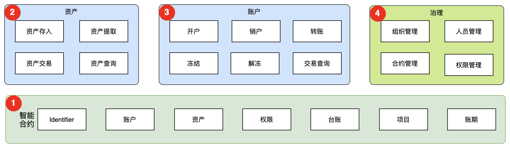
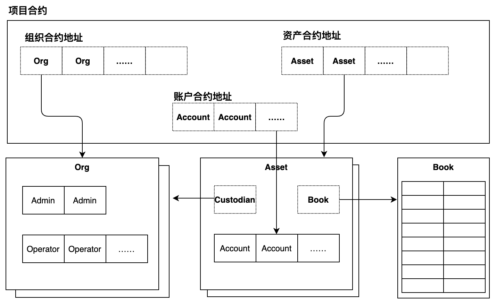
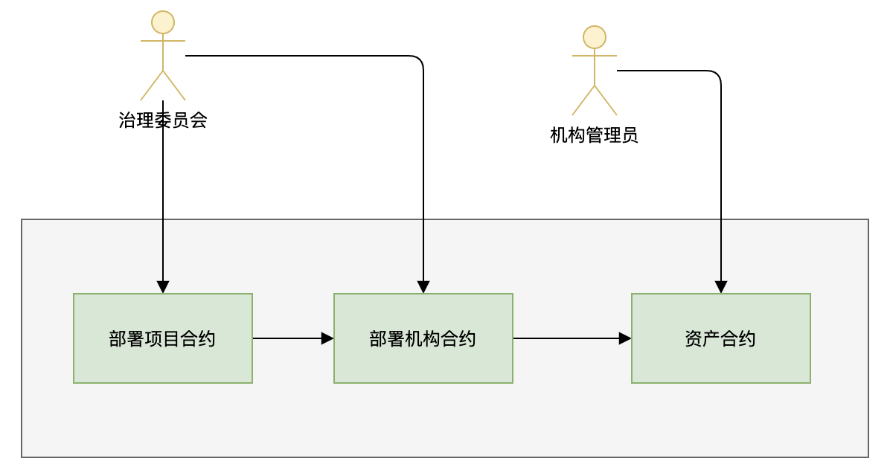
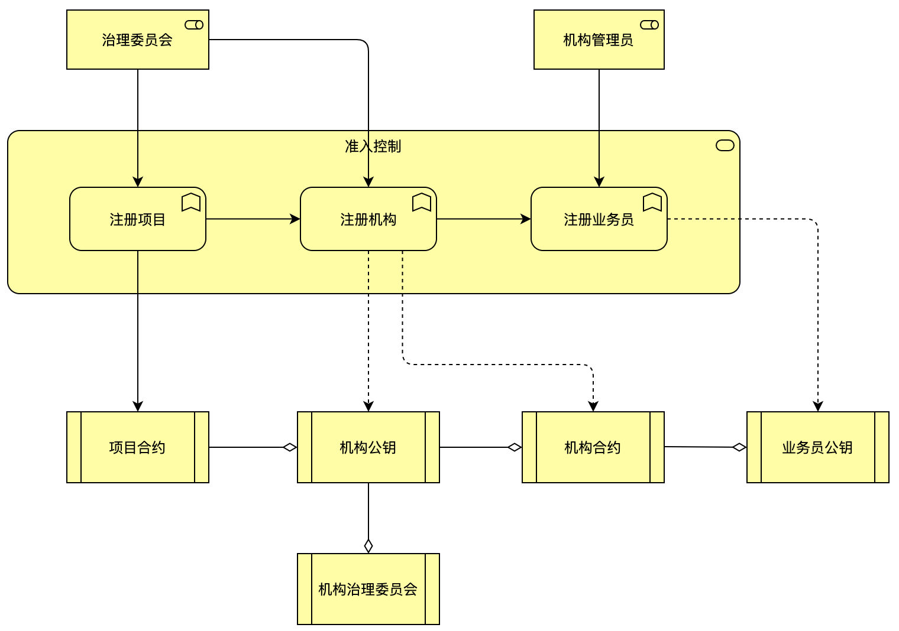
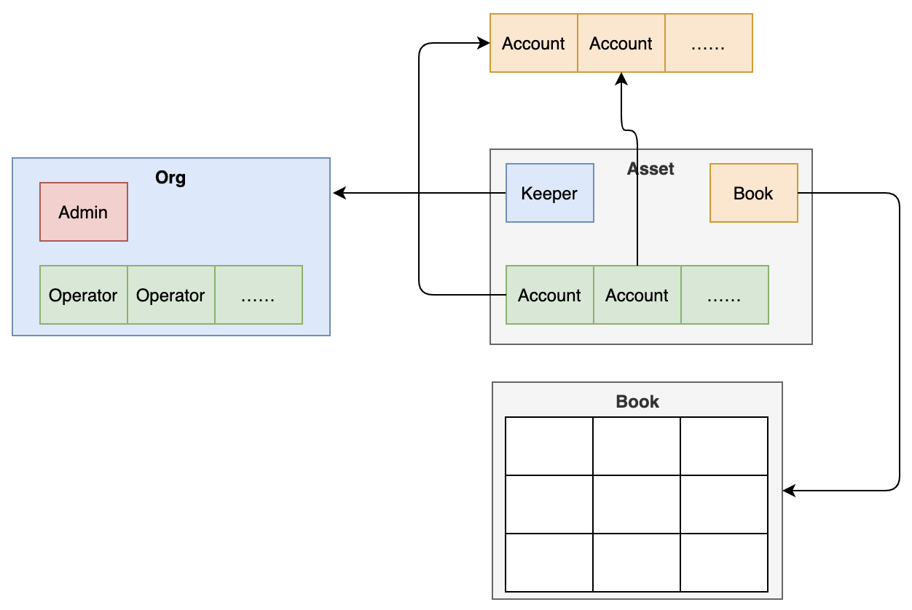

# 架构

WebankBlockchain-OpenLedger（简称OpenLedger）分布式账本解决方案是一套基于区块链账户模型的软件开发工具包（Software Development Kit，SDK），底层区块链采用FISCO BCOS平台，智能合约以Solidity语言开发，SDK使用Java语言开发。

解决方案分智能合约，资产模块，账户模块和治理模块4个核心模块。

- 1）智能合约，为解决方案的合约模块，包括账户、资产、权限、项目等合约；
- 2）资产模块，提供资产的注册开通、资产存入、资产提取、资产交易以及资产查询功能；
- 3）账户模块，提供账户开户、销户、冻结、解冻、密码重置，转账以及查询等功能；
- 4）治理模块，提供组织注册，管理员与业务员注册与销户，合约部署与授权，以及权限管理等功能。
# 核心技术

- 基于公私钥的可扩展ID设计

    WebankBlockchain-OpenLedger采用使用统一ID标识设计，确保账号在全账本范围内的唯一性。这使得数字资产、账户、所有人等可以穿透全产业链，也是实现穿透式监管的保证。
- 安全可信的账户体系

  WebankBlockchain-OpenLedger基于ID设计了由企业账户、个人账户组成的灵活账户体系，让组织内个人也可以用自己的私钥来管理同一个企业账户的数据。
    
- 双重签名

  WebankBlockchain-OpenLedger设计了双重签名功能，以实现离线交易。启用双重签名时，用户仍然可以使用自己的私钥对交易进行签名，签名后的交易可以安全、无篡改地通过公网传递到OpenLedger SDK，经OpenLedger SDK进行二次签名后提交给区块链系统。
- 职责分离的资产模型

  WebankBlockchain-OpenLedger基于职责分离的资产模型构建可信的托管人机制：所有数据资产都有确定的托管人，托管人负责记录数字资产的上链过程和下链过程。数字资产在链上的流转，则由账户所有人自己负责。
- 支持同质化和非同质化资产交易与记账

  WebankBlockchain-OpenLedger提供同质与非同质化资产通用的接口，实现托管与非托管模式下资产交易的合规化记账，保证业务逻辑升级不影响账本数据，保障账本数据完整性与安全性，方便实现自动清算、结算，友好、平稳地进行场景切换。

- 开放体系

  WebankBlockchain-OpenLedger立足传统业务场景，糅合微众技术体系下的区块链权限治理组件、智能合约敏捷开发组件、隐私保护等技术解决方案，旨在成为实际业务场景与区块链技术体系之间的连接纽带，为传统业务场景提供一站式的分布式账本。

# 智能合约

## 项目

业务以项目合约为单位开展，围绕业务，项目合约对业务下的组织账户、权限控制、资产管理进行合约初始化以及合约地址维护。

## Identifier

简称ID，用于定义对象的标识信息，在解决方案里的账户、资产等核心组件均包含一个ID。使用前需要凭公钥注册开通，将公钥存入合约内，使用时使用对应的私钥签名，在合约内通过公钥验证。

## 组织

业务的主要参与者，组织拥有账户，存储自己的资产和资金，同时组织也可以担任保管人负责保管一种或者多种资产。组织有管理员和业务员，管理员对本组织的人员进行管理；业务员代表组织执行业务。

## 账户

个人，组织、管理员、业务员均需要先注册开通账户才能启用，个人、管理员、业务员在进行交易或其他操作前，必须使用自己的私钥对交易进行签名完成身份校验。账户与机构以及合约的关系如图所示。

## 资产

资产必须先通过注册开通方能使用，注册由担任该资产保管人的机构负责，具体执行由该机构的业务员操作。该资产的存入与提取也有保管人负责。保管人依据真实业务向某个账户存入一定额度的资产，该账户所有人可以通过业务交易将资产转移给其他账户。

## 账本

每种资产有一个账本，账本记录该资产的所有交易记录。账户、账本、资产以及机构的相互关系如图所示。

