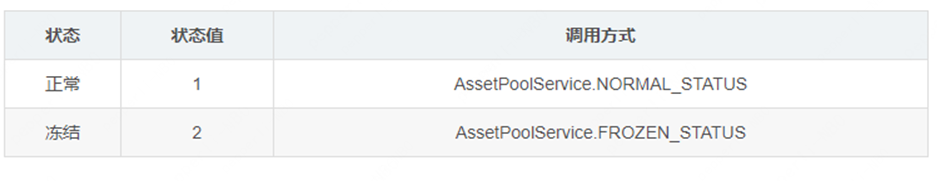

## 资产池管理

资产池的所有操作权限仅限组织管理员。

### 创建资产池

调用示例：

```java
// 组织合约地址
String orgAddress="0x698bc024c1127cae3c108f1e2bc49e51b067cc56";
// authCenter合约地址
String authCenterAddress="0x698bc024c1127cae3c108f1e2bc49e51b067cc56"
// 调用创建资产池接口 返回资产池合约地址
String contractAddress = AssetPoolService.createAssetPool(blockchain, orgAddress, authCenterAddress);
// 加载资产池Service
Blockchain blockchain = new Blockchain("application.properties");
AssetPoolService assetPoolService = new AssetPoolService(blockchain, contractAddress);
```

### 添加资产

添加资产到资产池。

调用示例：

```java
// 组织管理员公私钥对 
CryptoKeyPair admin = new CryptoSuite(CryptoType.ECDSA_TYPE, "admin private key").getCryptoKeyPair(); 
// 获取交易发起方交易序号
BigInteger nonce = authCenterService.getNonceFromAccount(admin.getAddress()).getResult();
// 资产合约地址
String assetContractAddress="0x698bc024c1127cae3c108f1e2bc49e51b067cc56";
// 组装参数并进行hash
byte[] args = OpenLedgerUtils.concatByte(OpenLedgerUtils.convertStringToAddressByte(assetContractAddress), OpenLedgerUtils.getBytes32(nonce.toByteArray()));
byte[] message = OpenLedgerUtils.computeKeccak256Hash(args);
// 对hash进行签名
ECDSASignatureResult rs = OpenLedgerUtils.sign(admin, message);
// 调用资产池添加资产接口
ResponseData<List<String>> response = assetPoolService.addAsset(assetContractAddress, message, rs);
// 获取返回资产列表
List<String> assetList = response.getResult();
```

### 移除资产

从资产池中移除资产。

```java
// 组织管理员公私钥对 
CryptoKeyPair admin = new CryptoSuite(CryptoType.ECDSA_TYPE, "admin private key").getCryptoKeyPair(); 
// 获取交易发起方交易序号
BigInteger nonce = authCenterService.getNonceFromAccount(admin.getAddress()).getResult();
// 资产合约地址
String assetContractAddress="0x698bc024c1127cae3c108f1e2bc49e51b067cc56";
// 组装参数并进行hash
byte[] args = OpenLedgerUtils.concatByte(OpenLedgerUtils.convertStringToAddressByte(assetContractAddress), OpenLedgerUtils.getBytes32(nonce.toByteArray()));
byte[] message = OpenLedgerUtils.computeKeccak256Hash(args);
// 对hash进行签名
ECDSASignatureResult rs = OpenLedgerUtils.sign(admin, message);
// 调用资产池添加资产接口
ResponseData<List<String>> response = assetPoolService.removeAsset(assetContractAddress, message, rs);
// 获取返回资产列表
List<String> assetList = response.getResult();
```


### 添加资产池状态

调用示例：

```java
// 组织管理员公私钥对 
CryptoKeyPair admin = new CryptoSuite(CryptoType.ECDSA_TYPE, "admin private key").getCryptoKeyPair(); 
// 获取交易发起方交易序号
BigInteger nonce = authCenterService.getNonceFromAccount(admin.getAddress()).getResult();
// 构建资产池状态对象 new PoolStatus(status:状态值,name:状态名称，desc:状态描述)
PoolStatus p1 = new PoolStatus(BigInteger.valueOf(1), "name", "desc");

// 组装参数
byte[] args = OpenLedgerUtils.concatByte(OpenLedgerUtils.getBytes32(p1.getStatus().toByteArray()), p1.getName().getBytes("utf-8"), p1.getDesc().getBytes("utf-8"), OpenLedgerUtils.getBytes32(nonce.toByteArray()));
// 对参数进行hash
byte[] message = OpenLedgerUtils.computeKeccak256Hash(args);
// 对hash进行签名
ECDSASignatureResult rs = OpenLedgerUtils.sign(admin, message);

// 调用添加资产池状态接口
ResponseData<BigInteger> responseData = assetPoolService.addStatus(p1, message, rs);
// 返回状态值
BigInteger status = responseData.getResult();
```


###  更新资产状态

调用示例：

```java
// 组织管理员公私钥对 
CryptoKeyPair admin = new CryptoSuite(CryptoType.ECDSA_TYPE, "admin private key").getCryptoKeyPair(); 
// 获取交易发起方交易序号
BigInteger nonce = authCenterService.getNonceFromAccount(admin.getAddress()).getResult();
// 更新资产池状态值
BigInteger newStatus=BigInteger.valueOf(1);
// 需要更新状态的资产合约地址
String assetContractAddress="0x698bc024c1127cae3c108f1e2bc49e51b067cc56";

// 组装参数并计算hash
byte[] args = OpenLedgerUtils.concatByte(OpenLedgerUtils.convertStringToAddressByte(assetContractAddress), OpenLedgerUtils.getBytes32(newStatus.toByteArray()), OpenLedgerUtils.getBytes32(nonce.toByteArray()));
byte[] message = OpenLedgerUtils.computeKeccak256Hash(args);
// 对hash进行签名
ECDSASignatureResult rs = OpenLedgerUtils.sign(admin, message);
// 调用更新资产状态接口
ResponseData<BigInteger> responseData = assetPoolService.moveAsset(assetContractAddress, newStatus, message, rs);
// 获取当前资产最新状态
BigInteger curStatus = responseData.getResult();
```


### 冻结/解冻资产池

资产池状态说明：




#### 1.冻结资产池

冻结资产池后将无法对资产池进行任何操作。

调用示例：

```java
// 组织管理员公私钥对 
CryptoKeyPair admin = new CryptoSuite(CryptoType.ECDSA_TYPE, "admin private key").getCryptoKeyPair(); 
// 获取交易发起方交易序号
BigInteger nonce = authCenterService.getNonceFromAccount(admin.getAddress()).getResult();
// 对序列号进行hash
byte[] message = OpenLedgerUtils.computeKeccak256HashFromBigInteger(nonce);
// 对hash进行签名
ECDSASignatureResult rs = OpenLedgerUtils.sign(admin, message);
// 调用冻结资产池接口
ResponseData<BigInteger> poolStatus = assetPoolService.freezePool(message, rs);
// 返回当前资产池状态
BigInteger status = poolStatus.getResult();
```


#### 2.解冻资产池

```java
// 组织管理员公私钥对 
CryptoKeyPair admin = new CryptoSuite(CryptoType.ECDSA_TYPE, "admin private key").getCryptoKeyPair(); 
// 获取交易发起方交易序号
BigInteger nonce = authCenterService.getNonceFromAccount(admin.getAddress()).getResult();
// 对序列号进行hash
byte[] message = OpenLedgerUtils.computeKeccak256HashFromBigInteger(nonce);
// 对hash进行签名
ECDSASignatureResult rs = OpenLedgerUtils.sign(admin, message);
// 调用解冻资产池接口
ResponseData<BigInteger> poolStatus = assetPoolService.unFreezePool(message, rs);
// 返回当前资产池状态
BigInteger status = poolStatus.getResult();
```


### 获取资产池当前状态

调用示例：

```java
BigInteger Status = assetPoolService.getPoolStatus();
```


### 获取资产池资产列表

```java
// 组织管理员公私钥对 
CryptoKeyPair admin = new CryptoSuite(CryptoType.ECDSA_TYPE, "admin private key").getCryptoKeyPair(); 
// 获取交易发起方交易序号
BigInteger nonce = authCenterService.getNonceFromAccount(admin.getAddress()).getResult();
// 对序列号进行hash
byte[] message = OpenLedgerUtils.computeKeccak256HashFromBigInteger(nonce);
// 对hash进行签名
ECDSASignatureResult rs = OpenLedgerUtils.sign(admin, message);
// 调用获取资产列表接口 获取资产地址列表
List<String> result = assetPoolService.getAssetList(message, rs);
```

