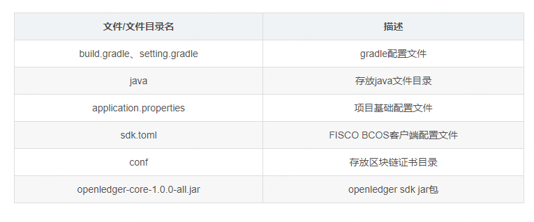
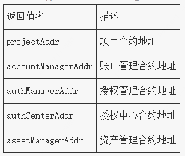

## 初始化应用 


### 运行环境准备

#### 1. 安装环境

- 安装Java：JDK 14 （JDK1.8 至JDK 14都支持）


- IDE：IntelliJ IDE. 

  进入[IntelliJ IDE官网](https://www.jetbrains.com/idea/download/)，下载并安装社区版IntelliJ IDE
  
  

#### 2. 搭建一条FISCO BCOS链

请参考[FISCO BCOS安装](https://fisco-bcos-documentation.readthedocs.io/zh_CN/latest/docs/installation.html)搭建。

### 创建项目

#### 1.创建一个Gradle应用

项目目录结构：

```bash
demo
│  build.gradle
│  settings.gradle
│
└─lib
   └─openledger-core-1.0.0-all.jar
│
└─src
    └─main
        ├─java
        │
        └─resources
            │  application.properties
            │  sdk.toml
            │
            └─conf
```





#### 2.引入区块链分布式账本Service

打开`build.gradle`，在`dependencies`添加lib依赖。

示例：

``` properties
dependencies {
  // 添加本地lib依赖
    compile fileTree(dir:'lib',includes:['*jar'])
}
```


### 基础配置文件说明

区块链分布式账本Service主要包含一下配置项：

- 证书配置(必须)
- 区块链节点连接配置(必须)
- 区块链交易账户配置(必须)

#### 1.证书配置

参考[java Service证书配置](./configuration.html#id5)。

1. 将配置文件`config-example.toml`重命名为`sdk.toml` 存放在应用的`resources`目录下。

   - config-example.toml可以在java-Service [GitHub链接](https://github.com/FISCO-BCOS/java-Service/blob/master/src/test/resources/config-example.toml)或[Gitee链接](https://gitee.com/FISCO-BCOS/java-Service/blob/master/src/test/resources/config-example.toml)的源文件以下位置找到：`src/test/resources/config-example.toml`


2. 修改`sdk.toml`中节点的IP和端口，与您要连接的节点所匹配。

   ``` properties
   [network]
   peers=["127.0.0.1:20200"]
   ```


#### 2.拷贝证书

从节点`nodes/${ip}/Service/` 目录下的证书拷贝到`conf`目录。

#### 3.修改项目配置文件

修改`application.properties`文件中`blockchain.txKey`为`conf`目录下的账户私钥文件

示例：

``` properties
blockchain.txKey=0x11a070299af8ec007927188f91d40759d1a7c525.pem
```


### 项目初始化

项目初始化主要初始化账户管理、授权管理、授权中心、资产管理以及项目合约，基于以上合约实现区块链应用的项目管理、账户管理、权限管理、资产管理的功能。

#### jar包初始化方式

- 1.在`openledger-core-1.0.0-all.jar`同级目录准备基础配置文件
```bash
    
    |  openledger-core-1.0.0-all.jar
    │  application.properties
    |  sdk.toml
    |
    └─conf
```
​    请参考[基础配置文件说明](#基础配置文件说明)

- 2.在`openledger-core-1.0.0-all.jar`所在目录执行一下命令初始化：

```java
java -jar openledger-core-1.0.0-all.jar
```

- 3.记录控制台执行结果

  执行成功后，控制台将输出初始化部署的相关合约地址，如：

  ``` bash
   INFO [16460-1 main] [InitApplication.java:27 main] String projectAddr = "0x4633b054c47ff682b7877f326145a5d150f99f10";
  String accountManagerAddr = "0x4910d2ada3ad689ca041e0f196a56b35ac84bbb3";
  String authManagerAddr = "0x25589e4ffd6780af7d461c74068e18eaefd398ab";
  String authCenterAddr = "0xdf7cd28f31cdfbc0baba1558e8ebd288b2bccc99";
  String assetManagerAddr = "0x44a0241585d77a19b21f7bf0aa3b9075c85be63b";
  
  ```

  

#### 代码调用初始化方式


调用示例：

```java
// 合约地址
String projectAddr = null;
// 区块链配置管理对象
BlockChain blockchain = new Blockchain("application.properties");
// 加载projectService
ProjectService<Project> projectService= new ProjectService(blockchain, projectAddr);
// 调用项目初始化接口
ResponseData<List<String>> rsp = this.projectService.createProject();
// 获取返回合约地址列表
log.info("create project:{}", rsp.getResult());
        log.info("\r\n String projectAddr = \"{}\"; \r\n    " +
                        "String accountManagerAddr = \"{}\"; \r\n   " +
                        "String authManagerAddr = \"{}\"; \r\n   " +
                        "String authCenterAddr = \"{}\";  \r\n  " +
                        "String assetManagerAddr = \"{}\";",
                rsp.getResult().get(0),
                rsp.getResult().get(1),
                rsp.getResult().get(2),
                rsp.getResult().get(3),
                rsp.getResult().get(4)); 
```

#### 返回值说明


### 加载Service

- 1.加载项目Service：ProjectService

  调用示例：

```java
// project合约地址
String projectAddr = "0x9d4c7a1737bb023d77e7652b27401a6e920a9039";
Blockchain blockchain = new Blockchain("application.properties");
ProjectService<Project> projectService= new ProjectService(blockchain, projectAddr);
```


- 2.加载授权Service：AuthCenterService

  调用示例：

```java
// authCenter合约地址
String contractAddr = "0x9d4c7a1737bb023d77e7652b27401a6e920a9039";
Blockchain blockchain = new Blockchain("application.properties");
AuthCenterService<AuthCenter> authCenterService= new ProjectService(blockchain, contractAddr);
```

- 3.加载组织Service:OrganzationService

  调用示例：

```java
// Organization合约地址，创建组织后获取
String contractAddr = "0x9d4c7a1737bb023d77e7652b27401a6e920a9039";
Blockchain blockchain = new Blockchain("application.properties");
OrganizationService<Organization> orgService = new OrganizationService(blockchain, contractAddr);
```

- 4.加载同质化资产Service:FungibleAssetService

  调用示例：

```java
// 资产合约地址 通过组织createAssetWithSign接口创建
String contractAddress="0x7a3bc024c1127cae3c108f1e2bc49e51b067cc57";
// 加载区块链信息
Blockchain blockchain = new Blockchain("application.properties");
// 加载FungibleAssetService
FungibleAssetService fungibleAssetService = new FungibleAssetService(blockchain, contractAddress);
```

- 5.加载非同质化资产Service:NonFungibleAssetService

  调用示例：

```java
// 资产合约地址 通过组织createAssetWithSign接口创建
String contractAddress="0x7a3bc024c1127cae3c108f1e2bc49e51b067cc57";
// 加载区块链信息
Blockchain blockchain = new Blockchain("application.properties");
// 加载NonFungibleAssetService
NonFungibleAssetService nonFungibleAssetService = new NonFungibleAssetService(blockchain, contractAddress);
```


- 6.加载账期Service：TermService

  调用示例：

```java
  // 账期合约地址 通过projectService.getProject().getTerm()获取
  String contractAddress="0x7a3bc024c1127cae3c108f1e2bc49e51b067cc57";
  // 加载区块链信息
  Blockchain blockchain = new Blockchain("application.properties");
  // 加载termService
  TermService termService = new TermService(blockchain, contractAddress);
```


- 7.加载资产池Service：AssetPoolService

  调用示例：

```java
  // 通过调用AssetPoolService.createAssetPool() 获取
  String contractAddress="0x7a3bc024c1127cae3c108f1e2bc49e51b067cc57";
  // 加载区块链信息
  Blockchain blockchain = new Blockchain("application.properties");
  // 加载AssetPoolService
  AssetPoolService assetPoolService = new AssetPoolService(blockchain, contractAddress);
```

  


