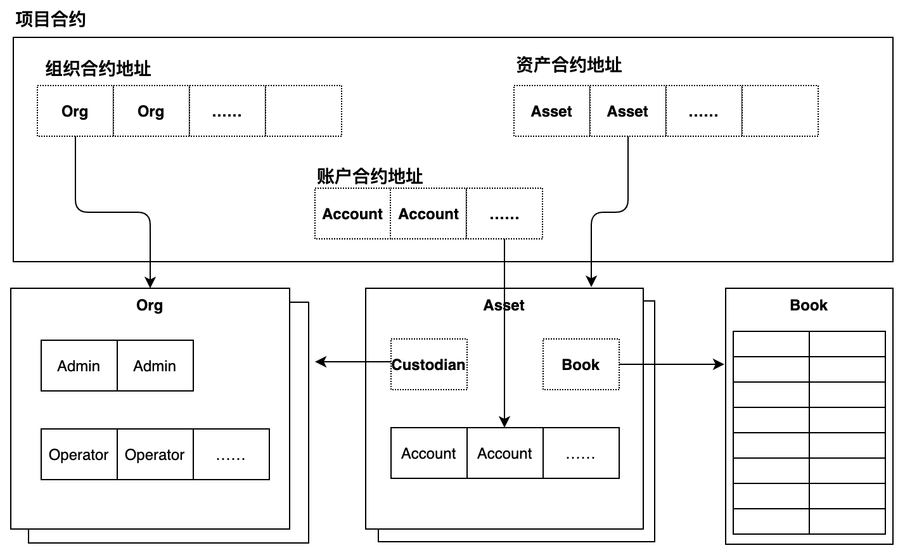

# 什么是WebankBlockchain-OpenLedger？

WebankBlockchain-OpenLedger是安全、合规、多方协助的企业级分布式账本解决方案。

# WebankBlockchain-OpenLedger特性 

## 更安全

联盟链的参与主体众多，网络复杂，需要向公众提供服务的业务系统还需要向公共互联网开放，网络环境就更复杂了。常见的做法是将业务部署在安全的内部网络环境中，托管用户私钥或者通过中间业务系统代理，用户不与区块链直接交互的方式向用户提供区块链服务。前一种方式有用户私钥被泄露、被恶意利用的风险，同时还增加了私钥的管理成本；后一种方式有用户被冒充、难以保证交易是用户本人发起的困难。

涉及金融等敏感业务的场景中，为了有效保护客户资产不被恶意盗取、利用，保护隐私与机密信息不被泄露等安全目的，运营机构还要通过前后台业务分离，划分不同的部门，设置不同的岗位等措施，这无疑会增加机构的治理成本。

WebankBlockchain-OpenLedger增强了安全性设计，可以让用户始终使用自己的私钥签名，在区块链上验证签名，从而可以达到签名数据可以安全穿透复杂网络不被篡改的风险。结合灵活的权限设计，有效保护链上资产，让账户管理的责任划分更加清晰，大大降低私钥泄露的风险，也有利于机构内部账户管理的难度。

## 账户类型

一般区块链平台仅提供一种账户，账户与账户没有差别，每个账户与一对公私钥唯一对应。只有通过私钥签名才能操作账户内的资产，这种账户适合个人使用。但是在很多商业场景中，机构是更常见的参与者，因为机构本身也是独立的实体，机构拥有自己的账户和资产。机构根据岗位划分职责，授予业务员管理机构资产的权限，位于同一岗位的不同的业务员可以执行相同的业务操作。为了更好地满足商业业务的需要，WebankBlockchain-OpenLedger增设了企业账户。机构可以根据业务需要，授予多个业务员操作企业账户的权限，而每个业务员仍然拥有自己的公私钥对，系统根据业务员自己的公私钥进行身份验证和管理权限。

## 增强KYC

联盟链有多个机构协同维护，平台上的每项服务都有具体的机构提供，享受该服务的消费者可以是个人也可以是机构。作为服务提供者有验证服务消费者身份，跟踪其基本信息变化、及时更新的责任，这称为KYC（Know Your Customer，了解你的客户）。WebankBlockchain-OpenLedger对KYC治理有更严格的要求，个人或机构需要享用某项服务必须首先通过提供该服务的机构完成注册。该机构为成为该用户客户账户的管理者，负责验证客户身份，帮其完成注册。注册完成之后，只有该机构可以修改此用户的基本信息，其他机构则无权修改。

## 保管人

链上数据与链下的资产不一致一直是区块链的突出问题。为了解决该问题，我们引入保管人角色，每种资产都有唯一的保管人，保管人负责链上数据与链下资产的一致性——资产的增加与减少。一般账户所用人只能通过转账等操作转移链上数据。

# 核心组件

WebankBlockchain-OpenLedger内部顶层核心模块包括Project，Asset，Org，Account，Book等组件，它们的相互关系如下图所示。

## Project

项目（Project）是不同的参与者通过WebankBlockchain-OpenLedger相互协助实现商业业务活动的统称，例如商户和银行合作发行消费券、资产证券化等，都是一个项目。Project是项目数据的隔离墙，也是项目的总访问入口。Project合约需要在项目初始化的时候部署，部署可以通过WebankBlockchain-OpenLedger部署工具或者SDK部署。

参与该项目的机构，项目涉及到的资产、账号等数据要在项目内注册。Project能很好的实现业务数据的独立性，即使是不同的Project可以注册在同一个群组内，不同Project的数据也不会混淆。用户不需要重新连接区块链，只需要访问不同的Project合约，就可以达到切换项目业务的目的。

## Org

Org代表机构，每个参与机构注册一个Org合约。一个Org内可以注册管理员和业务员两种角色，管理员用于管理本机构的业务员，可以增加、删除业务员。业务员代表机构负责执行具体的业务。

## Asset

Asset代表资产，一个Asset合约代表一类资产，不同合约的资产是不同的。每种资产有唯一的一个保管者（Keeper），保管者是一个机构。只有保管者才有权限对该资产进行“存款”与“取款”的操作，其他用户只能通过“转账”从自己的账户的资产转移给别的账户或者接收别人转入自己账户的资产。

## Account

账户用来存放与记录用户资产的，用户经过KYC注册之后，开通账户，每个账户有一个唯一的标识——账号。账户可以是个人账户也可以是企业账户。

账户内可以存放一种或者多种资产。

## Book

可追溯是区块链的最吸引的特性之一，但是资产变化的历史记录是分散的，而且也没有提供方便的接口供用户查询。WebankBlockchain-OpenLedger设计了台账（Book）用于记录资产的交易记录。每种资产有一个台账，台账记录的交易记录不能删除和修改，通过台账可以追溯资产的所有变化历史，更加容易做到可追溯。Book支持各种查询接口，可以方便地按照不同的查询条件查询历史记录。